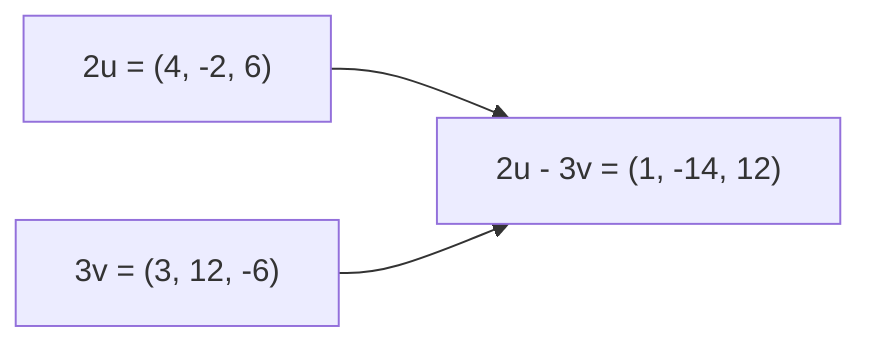
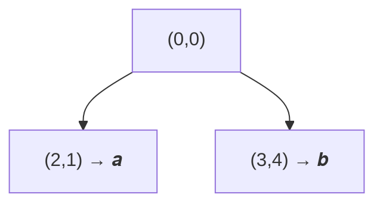
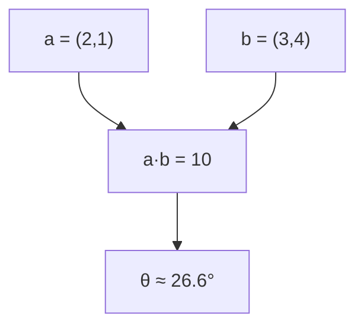
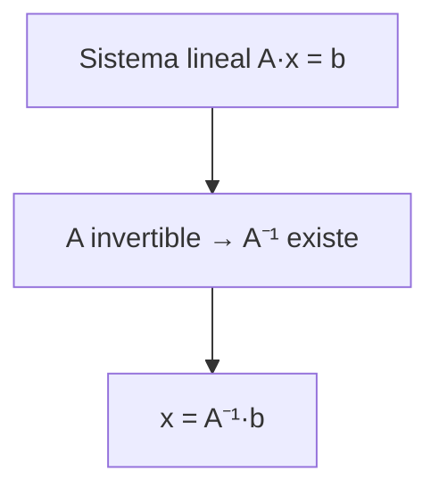
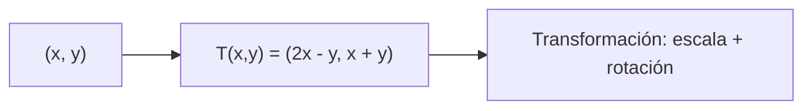
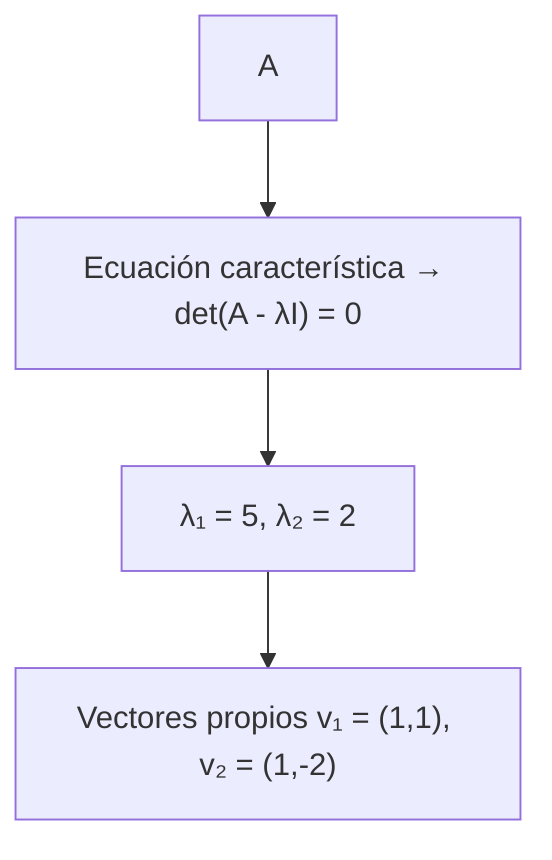

# Álgebra lineal
`$= dv.current().file.tags.join(" ")`

- [matematicas](/uncategorized/mates/)
- [Intro Algebra lineal y ML](/mates/intro-algebra-lineal-y-ml/)
- [Cálculo numérico](/mates/c-lculo-num-rico/)
- [Teoría de la probabilidad y teoría de la información](/mates/teor-a-de-la-probabilidad-y-teor-a-de-la-informaci-n/)
- 
- Matrices especiales
- Descomposición propia
- Descomposición del valor singular
- Pseudoinverso de Moore-Penrose
- Operador de seguimiento
- Determinantes
- Ejemplo: análisis de componentes principales
## Matrices especiales

Las **matrices especiales** son aquellas con propiedades estructurales o algebraicas particulares que facilitan su análisis y cálculo. Algunas de las más relevantes son:

- **Matriz diagonal**: solo tiene elementos distintos de cero en su diagonal principal. Simplifica operaciones como la multiplicación o la potenciación.  
	- Ejemplo: $D = \text{diag}(d_1, d_2, ..., d_n)$
- **Matriz identidad**: diagonal con todos los elementos diagonales iguales a 1. Actúa como elemento neutro en la multiplicación: $AI = IA = A$.
- **Matriz simétrica**: $A = A^T$. Representa transformaciones donde los ejes principales permanecen ortogonales, muy usada en análisis de componentes principales (PCA).
- **Matriz ortogonal**: $Q^TQ = QQ^T = I$. Sus columnas son vectores unitarios y ortogonales entre sí. Preserva la norma y los ángulos.
- **Matriz hermítica**: versión compleja de la simétrica, donde $A = A^*$ (transpuesta conjugada).
- **Matriz unitaria**: generalización compleja de la ortogonal. Cumple $U^*U = I$.
- **Matriz triangular**: superior o inferior, según la ubicación de los ceros. Fundamental en métodos de factorización como LU o QR.
- **Matriz de permutación**: representa un reordenamiento de filas o columnas.

Estas matrices suelen usarse en descomposiciones y transformaciones fundamentales del álgebra lineal y la computación científica.

---

## Descomposición propia (Autovalores y autovectores)

La **descomposición propia** o **descomposición espectral** se aplica a matrices cuadradas, especialmente simétricas. Permite expresar una matriz $A$ como:

$$A = PDP^{-1}$$

donde:
- $D$ es una matriz diagonal con los **autovalores** $\lambda_i$,
- $P$ contiene los **autovectores** asociados en sus columnas.

Si $A$ es **simétrica**, entonces $P$ es ortogonal, y la descomposición se simplifica a:

$$A = Q \Lambda Q^T$$

Esta forma muestra que $A$ puede interpretarse como una combinación ponderada de direcciones invariantes.

### Propiedades clave
- Los autovalores indican la “intensidad” de la transformación en cada dirección propia.
- Los autovectores indican las direcciones invariantes bajo la transformación.
- En geometría y PCA, representan los ejes principales de variación.

---

## Descomposición del valor singular (SVD)

La **descomposición en valores singulares (SVD)** generaliza la descomposición propia a matrices no cuadradas. Toda matriz $A_{m \times n}$ puede escribirse como:

$$A = U \Sigma V^T$$

donde:
- $U$ es ortogonal ($U^TU = I_m$),
- $V$ es ortogonal ($V^TV = I_n$),
- $\Sigma$ es diagonal (o rectangular) con los **valores singulares** $\sigma_i \ge 0$.

### Interpretación
- Los valores singulares representan la magnitud de la transformación lineal en direcciones específicas.
- Las columnas de $U$ y $V$ son los vectores propios de $AA^T$ y $A^TA$, respectivamente.
- Es útil en reducción de dimensiones, PCA, filtrado de ruido y compresión de datos.

### Código (Ejemplo en Python)

```python
import numpy as np

A = np.array([[3, 1], [1, 3]])
U, S, Vt = np.linalg.svd(A)

print("U =", U)
print("Valores singulares =", S)
print("Vt =", Vt)
```
`

---

## Pseudoinverso de Moore-Penrose

El **pseudoinverso de Moore-Penrose** ( A^+ ) extiende el concepto de matriz inversa a matrices no cuadradas o singulares. Se define como la única matriz que cumple:

$$
AA^{+}A = A, \qquad A^{+}AA^{+} = A^{+}, \qquad (AA^{+})^{T} = AA^{+}, \qquad (A^{+}A)^{T} = A^{+}A
$$

Cálculo mediante la descomposición en valores singulares (SVD). Si
$A = U \Sigma V^{T}$, entonces

$$
A^{+} = V \,\Sigma^{+}\, U^{T}
$$

donde $\Sigma^{+}$  se obtiene invirtiendo los valores singulares distintos de cero.

### Aplicaciones

* Resolver sistemas sobredeterminados o subdeterminados.
* Minimizar errores cuadráticos (( |Ax - b|^2 )).
* Fundamental en regresión lineal y aprendizaje automático.

### Código


```python
import numpy as np

A = np.array([[1, 2], [3, 4], [5, 6]])
A_pinv = np.linalg.pinv(A)
print(A_pinv)
```


---

## Operador de seguimiento (Trace)

El **operador de seguimiento** o **traza** de una matriz cuadrada ( A ) se define como la suma de sus elementos diagonales:

$$
\text{tr}(A) = \sum_i a_{ii}
$$

### Propiedades

* Linealidad: ( \text{tr}(A + B) = \text{tr}(A) + \text{tr}(B) ).
* Invarianza por ciclo: ( \text{tr}(AB) = \text{tr}(BA) ).
* Igual a la suma de los autovalores de ( A ).
* En geometría, puede interpretarse como el **rastro de una transformación lineal** (cuánto “escala” el espacio).

---

## Determinantes

El **determinante** de una matriz cuadrada ( A ) mide el **factor de escala** de la transformación lineal que representa. Si ( \det(A) = 0 ), la matriz no es invertible.

### Propiedades

* ( \det(AB) = \det(A)\det(B) )
* ( \det(A^T) = \det(A) )
* Si ( A ) es triangular, su determinante es el producto de los elementos diagonales.
* ( \det(A^{-1}) = 1/\det(A) )

### Interpretación geométrica

* Representa el cambio de volumen (o área en 2D) bajo la transformación.
* El signo del determinante indica si hay una **inversión de orientación** (reflexión).

### Código


```python
import numpy as np

A = np.array([[2, 3], [1, 4]])
detA = np.linalg.det(A)
print(detA)
```


---

## Ejemplo: Análisis de Componentes Principales (PCA)

El **PCA** es una aplicación directa de la SVD y la descomposición propia. Su objetivo es **reducir la dimensionalidad** manteniendo la mayor varianza posible.

### Proceso

1. Estandarizar los datos.
2. Calcular la matriz de covarianza ( C = \frac{1}{n-1} X^TX ).
3. Obtener autovalores y autovectores de ( C ).
4. Ordenar los autovectores por los autovalores más grandes.
5. Proyectar los datos sobre las nuevas componentes principales.

### Código


```python
import numpy as np

X = np.array([[1, 2], [3, 4], [5, 6]])
X_centered = X - np.mean(X, axis=0)
cov = np.cov(X_centered, rowvar=False)
eigvals, eigvecs = np.linalg.eig(cov)
X_pca = X_centered.dot(eigvecs[:, :1])

print("Autovalores:", eigvals)
print("Autovectores:", eigvecs)
print("Datos proyectados:", X_pca)
```


### Interpretación

* Los autovectores indican las **direcciones principales** del espacio de datos.
* Los autovalores cuantifican la **varianza explicada** por cada componente.
* PCA es base para técnicas de reducción de dimensionalidad, machine learning y análisis estadístico.


# Fundamentos de Álgebra Lineal

El **álgebra lineal** es la rama de las matemáticas que estudia los **vectores**, las **matrices** y las **transformaciones lineales** entre espacios vectoriales. Constituye la base de gran parte de la matemática aplicada, la física, la estadística y la computación científica.

---

## Vectores

Un **vector** es un elemento de un espacio vectorial que puede representarse como una lista ordenada de números, llamados **componentes**.

$$\vec{v} = \begin{bmatrix} v_1 \\ v_2 \\ \vdots \\ v_n \end{bmatrix}$$

### Interpretación
- Geométricamente, representa una **dirección** y una **magnitud**.
- Algebraicamente, se interpreta como un **punto** o **tupla de coordenadas**.

### Operaciones básicas
- **Suma de vectores:**  
	$$\vec{u} + \vec{v} = (u_1 + v_1, u_2 + v_2, ..., u_n + v_n)$$
- **Multiplicación por un escalar:**  
	$$c\vec{v} = (cv_1, cv_2, ..., cv_n)$$
- **Producto escalar (o punto):**  
	$$\vec{u} \cdot \vec{v} = \sum_i u_i v_i$$
- **Norma (longitud):**  
	$$\|\vec{v}\| = \sqrt{\vec{v} \cdot \vec{v}}$$

Estas operaciones permiten construir conceptos más avanzados como la **proyección**, la **ortogonalidad** y las **transformaciones lineales**.

---

## Espacios vectoriales

Un **espacio vectorial** es un conjunto de vectores junto con dos operaciones:
1. **Suma de vectores**
2. **Multiplicación por escalares**

Estas operaciones deben satisfacer axiomas como asociatividad, conmutatividad, existencia de un vector nulo y de inversos aditivos.

Ejemplo:  
El conjunto $\mathbb{R}^n$ con las operaciones habituales de suma y multiplicación por escalar es un espacio vectorial.

### Subespacios
Un **subespacio** es un subconjunto de un espacio vectorial que también cumple los axiomas del espacio vectorial.  
Ejemplo: el conjunto de vectores de $\mathbb{R}^3$ que yacen en un plano que pasa por el origen.

---

## Combinaciones lineales

Una **combinación lineal** de vectores $\vec{v}_1, \vec{v}_2, ..., \vec{v}_k$ es cualquier vector que se pueda expresar como:

$$\vec{w} = c_1 \vec{v}_1 + c_2 \vec{v}_2 + ... + c_k \vec{v}_k$$

donde $c_i$ son escalares.

El **conjunto de todas las combinaciones lineales** posibles se llama el **subespacio generado** o **espacio generado** por esos vectores, denotado como:

$$\text{span}\{\vec{v}_1, ..., \vec{v}_k\}$$

---

## Independencia lineal

Un conjunto de vectores es **linealmente independiente** si **ninguno de ellos puede escribirse como combinación lineal de los demás**.  

Formalmente, los vectores $\vec{v}_1, ..., \vec{v}_k$ son independientes si:

$$c_1 \vec{v}_1 + ... + c_k \vec{v}_k = 0 \implies c_1 = c_2 = ... = c_k = 0$$

Si esta condición no se cumple, el conjunto es **dependiente**.

---

## Base y dimensión

Una **base** de un espacio vectorial es un conjunto de vectores **linealmente independientes** que **generan todo el espacio**.

- Toda combinación lineal de los vectores de la base puede representar **únicamente** un vector del espacio.
- La **dimensión** del espacio es el **número de vectores** de cualquier base.

Ejemplos:
- En $\mathbb{R}^2$, una base estándar es $\{(1,0), (0,1)\}$.
- En $\mathbb{R}^3$, la base estándar es $\{(1,0,0), (0,1,0), (0,0,1)\}$.

---

## Transformaciones lineales

Una **transformación lineal** es una función $T: V \to W$ entre espacios vectoriales que cumple:

$$T(\vec{u} + \vec{v}) = T(\vec{u}) + T(\vec{v}), \quad T(c\vec{v}) = cT(\vec{v})$$

Toda transformación lineal puede representarse mediante una **matriz** que actúa sobre vectores por medio de la multiplicación matricial:

$$T(\vec{v}) = A\vec{v}$$

### Propiedades
- Conservan el origen y las combinaciones lineales.
- Pueden **rotar**, **escalar**, **reflejar** o **proyectar** espacios.
- Sus efectos geométricos pueden analizarse a través de los **autovalores y autovectores** de la matriz asociada.

### Código (Ejemplo de transformación lineal)

```python
import numpy as np

A = np.array([[2, 0], [0, 3]])  # Escala el eje x por 2 y el eje y por 3
v = np.array([1, 2])
T_v = A @ v

print("Vector transformado:", T_v)
```
`

---

## Aplicaciones básicas

* Representación de sistemas de ecuaciones lineales.
* Análisis geométrico de rotaciones y proyecciones.
* Cálculo de mínimos cuadrados.
* Base teórica para vectores, matrices y descomposición del valor singular.

---

## Conceptos relacionados

* Vectores y operaciones vectoriales
* Matrices y operaciones matriciales
* Espacios vectoriales y subespacios
* Transformaciones lineales y matrices asociadas
* Descomposición propia
* PCA y reducción de dimensionalidad


# Lenguaje matemático del Álgebra Lineal

Comprender el **lenguaje simbólico y formal** del álgebra lineal es esencial para poder interpretar correctamente sus definiciones, teoremas y demostraciones.  
Esta nota introduce la **notación**, **símbolos**, y **convenciones** más comunes que aparecen en libros, artículos o clases de álgebra lineal.

---

## Símbolos y notaciones fundamentales

### Conjuntos numéricos
- $\mathbb{N}$: números naturales $(0, 1, 2, 3, …)$
- $\mathbb{Z}$: números enteros $(..., -2, -1, 0, 1, 2, ...)$
- $\mathbb{Q}$: números racionales (fracciones)
- $\mathbb{R}$: números reales (línea continua)
- $\mathbb{C}$: números complejos $(a + bi)$

En álgebra lineal trabajamos principalmente sobre $\mathbb{R}$ o $\mathbb{C}$, llamados **campos base**.

---

## Notación de vectores y matrices

- **Vector columna**:  
	$$\vec{v} = 
	\begin{bmatrix} 
	v_1 \\ v_2 \\ \vdots \\ v_n 
	\end{bmatrix}$$
  Se representa con flecha ($\vec{v}$), letra minúscula negrita (**v**) o letra en minúscula (según el contexto).

- **Matriz**:  
	Una colección rectangular de números:
	$$A = 
	\begin{bmatrix}
	a_{11} & a_{12} & \cdots & a_{1n} \\
	a_{21} & a_{22} & \cdots & a_{2n} \\
	\vdots & \vdots & \ddots & \vdots \\
	a_{m1} & a_{m2} & \cdots & a_{mn}
	\end{bmatrix}$$

- **Dimensiones**:
	- Si $A$ tiene $m$ filas y $n$ columnas, se dice que $A \in \mathbb{R}^{m \times n}$.
	- Un vector columna $\vec{v} \in \mathbb{R}^n$ puede verse como una matriz $n \times 1$.

- **Índices**:
	- El elemento $a_{ij}$ está en la **i-ésima fila** y **j-ésima columna**.
	- El subíndice suele empezar en 1: $a_{11}, a_{12}, ...$

---

## Operaciones y símbolos comunes

| Símbolo                                      | Nombre             | Significado                                       |
| -------------------------------------------- | ------------------ | ------------------------------------------------- |
| $+$                                          | Suma               | Adición de vectores o matrices                    |
| $-$                                          | Resta              | Diferencia de vectores o matrices                 |
| $\cdot$ o $\langle \vec{u}, \vec{v} \rangle$ | Producto escalar   | Multiplicación componente a componente y suma     |
| $\times$                                     | Producto vectorial | Solo en $\mathbb{R}^3$                            |
| $AB$                                         | Producto matricial | Multiplicación entre matrices compatibles         |
| $A^T$                                        | Transpuesta        | Intercambia filas y columnas                      |
| $A^{-1}$                                     | Inversa            | Matriz que satisface $AA^{-1} = I$                |
| $\det(A)$                                    | Determinante       | Escalar que mide el cambio de volumen             |
| $\text{tr}(A)$                               | Trazar / Trace     | Suma de los elementos diagonales                  |
| $\| \vec{v} \|$                              | Norma              | Longitud o magnitud del vector                    |
| $\lambda$                                    | Autovalor          | Escala un autovector en una transformación lineal |
| $\vec{v}$                                    | Autovector         | Vector propio asociado a $\lambda$                |

---

## Notación funcional

Las **transformaciones lineales** se suelen escribir como funciones:

$$T: V \to W$$
$$T(\vec{v}) = A\vec{v}$$

donde $T$ es la transformación, $V$ y $W$ son espacios vectoriales, y $A$ es la matriz asociada.

### Ejemplo
$$T:
\begin{bmatrix}
x \\ y
\end{bmatrix}
\mapsto
\begin{bmatrix}
2x + y \\
x - y
\end{bmatrix}$$

Esto puede representarse como una multiplicación matricial:

$$T(\vec{v}) = 
\begin{bmatrix}
2 & 1 \\
1 & -1
\end{bmatrix}
\begin{bmatrix}
x \\ y
\end{bmatrix}$$

---

## Expresiones y cuantificadores

El álgebra lineal usa notación lógica para definir propiedades y teoremas:

- $\forall$: “para todo”  
	$\forall \vec{v} \in V, \, T(c\vec{v}) = cT(\vec{v})$
- $\exists$: “existe”  
	$\exists \lambda \in \mathbb{R} \, / \, A\vec{v} = \lambda\vec{v}$
- $\implies$: “implica que”  
	$\text{A invertible} \implies \det(A) \ne 0$
- $\iff$: “si y solo si”  
	$A$ es invertible $\iff$ sus columnas son linealmente independientes.

---

## Notación vectorial y geométrica

### Ángulos y ortogonalidad
Dos vectores son **ortogonales** si su producto escalar es cero:
$$\vec{u} \cdot \vec{v} = 0$$
y forman un ángulo de $90^\circ$.

### Proyecciones
La **proyección** de $\vec{u}$ sobre $\vec{v}$ se denota:
$$\text{proj}_{\vec{v}}(\vec{u}) = \frac{\vec{u} \cdot \vec{v}}{\|\vec{v}\|^2} \vec{v}$$

---

## Convenciones tipográficas

- Letras **mayúsculas** → matrices ($A, B, C, ...$)
- Letras **minúsculas con flecha o negrita** → vectores ($\vec{v}, \vec{u}, \mathbf{x}$)
- Letras **griegas** → escalares especiales o autovalores ($\lambda, \mu, \sigma$)
- $I$ → matriz identidad
- $0$ → vector o matriz nula, según el contexto

---

## Estructura típica de una expresión

Ejemplo de expresión simbólica con significado completo:

$$A\vec{x} = \vec{b}$$

Donde:
- $A \in \mathbb{R}^{m \times n}$: matriz de coeficientes  
- $\vec{x} \in \mathbb{R}^n$: vector de incógnitas  
- $\vec{b} \in \mathbb{R}^m$: vector de resultados  

Esta ecuación representa un **sistema de ecuaciones lineales**.

---

## Recomendaciones para leer expresiones matemáticas

1. **Identificar el tipo de objeto**: escalar, vector o matriz.  
2. **Analizar las dimensiones**: comprobar que las operaciones sean válidas.  
3. **Distinguir entre símbolos abstractos y concretos**:  
	- $A$ puede representar una matriz genérica o una matriz específica.  
4. **Buscar patrones**: los teoremas y propiedades suelen repetirse con diferentes nombres o símbolos.  
5. **Relacionar con su interpretación geométrica**: visualizar ayuda a entender los significados algebraicos.

---

## Conceptos relacionados

- Fundamentos de Álgebra Lineal  
- Vectores y operaciones vectoriales  
- Matrices y operaciones matriciales  
- Transformaciones lineales y matrices asociadas  
- Espacios vectoriales  
- Notación matemática general

---

# Problemas y soluciones de Álgebra Lineal

Esta nota reúne **problemas básicos con soluciones paso a paso**, útiles para practicar y reforzar la comprensión de los conceptos del Fundamentos de Álgebra Lineal y Lenguaje matemático del Álgebra Lineal.

Los diagramas **Mermaid** se usan para representar visualmente flujos de operaciones o relaciones entre vectores, matrices y transformaciones.

---

## 🧩 Problema 1: Suma y multiplicación escalar de vectores

Sean los vectores:
$$\vec{u} = (2, -1, 3), \quad \vec{v} = (1, 4, -2)$$

**Calcular:**
1. $\vec{u} + \vec{v}$
2. $2\vec{u} - 3\vec{v}$

### Solución paso a paso

1. **Suma de vectores**
   $$\vec{u} + \vec{v} = (2+1, -1+4, 3+(-2)) = (3, 3, 1)$$

2. **Combinación lineal**
   $$2\vec{u} - 3\vec{v} = 2(2, -1, 3) - 3(1, 4, -2)$$
   $$= (4, -2, 6) - (3, 12, -6) = (1, -14, 12)$$

### Representación Mermaid


`

---

## 🧮 Problema 2: Producto escalar y ángulo entre vectores

Dados:  
$$
\vec{a} = (2, 1), \quad \vec{b} = (3, 4)
$$

**Calcular:**

1. $\vec{a} \cdot \vec{b}$  
2. El ángulo entre ellos.

---

### 🧩 Solución

1. **Producto escalar:**

$$
\vec{a} \cdot \vec{b} = 2\cdot3 + 1\cdot4 = 10
$$

2. **Normas de los vectores:**

$$
|\vec{a}| = \sqrt{2^2 + 1^2} = \sqrt{5}, \quad |\vec{b}| = \sqrt{3^2 + 4^2} = 5
$$

3. **Ángulo entre los vectores:**

$$
\cos(\theta) = \frac{\vec{a} \cdot \vec{b}}{|\vec{a}||\vec{b}|} = \frac{10}{5\sqrt{5}} = \frac{2}{\sqrt{5}}
$$

$$
\Rightarrow \theta = \cos^{-1}\left(\frac{2}{\sqrt{5}}\right) \approx 26.6^\circ
$$

---

### 💡 Interpretación geométrica

El ángulo pequeño indica que los vectores $\vec{a}$ y $\vec{b}$ apuntan en direcciones similares, lo que se traduce en una alta **proyección mutua** (gran componente de uno sobre el otro).

Puedes visualizar la relación entre ellos con el siguiente diagrama (opcional, si usas Mermaid):



`


### Representación Mermaid





---


## 🧩 Problema 3: Sistema de ecuaciones lineales

Resolver:  
$$
\begin{cases}
x + 2y = 5 \\
3x - y = 4
\end{cases}
$$

---

### 💡 Solución matricial

$$
A =
\begin{bmatrix}
1 & 2 \\
3 & -1
\end{bmatrix}, \quad
\vec{x} =
\begin{bmatrix}
x \\ y
\end{bmatrix}, \quad
\vec{b} =
\begin{bmatrix}
5 \\ 4
\end{bmatrix}
$$

Entonces:  
$$
A\vec{x} = \vec{b}
$$

**Determinante:**
$$
\det(A) = (1)(-1) - (3)(2) = -7 \neq 0
$$

Por tanto, $A$ es **invertible**:

$$
A^{-1} = \frac{1}{-7}
\begin{bmatrix}
-1 & -2 \\
-3 & 1
\end{bmatrix}
$$

**Solución:**
$$
\vec{x} = A^{-1}\vec{b} =
\frac{1}{-7}
\begin{bmatrix}
-1 & -2 \\
-3 & 1
\end{bmatrix}
\begin{bmatrix}
5 \\ 4
\end{bmatrix}
=
\frac{1}{-7}
\begin{bmatrix}
-13 \\ -11
\end{bmatrix}
=
\begin{bmatrix}
13/7 \\ 11/7
\end{bmatrix}
$$

---

### 📊 Representación Mermaid



`

---

## 🔢 Problema 4: Transformación lineal y su efecto geométrico

Sea la transformación ( T: \mathbb{R}^2 \to \mathbb{R}^2 ) dada por:  
$$  
T(x, y) = (2x - y, , x + y)  
$$

**Determinar:**

1. La matriz asociada.
    
2. El efecto geométrico.
    

---

### 💡 Solución

1. Aplicamos (T) a los vectores base:
    

$$  
T(1,0) = (2,1), \quad T(0,1) = (-1,1)  
$$

Por tanto:

$$  
A =  
\begin{bmatrix}  
2 & -1 \  
1 & 1  
\end{bmatrix}  
$$

2. **Efecto geométrico:**
    
    - Escala el eje (x) por 2 y lo combina con (y).
        
    - Rota y estira el plano en direcciones oblicuas.
        

---

### 🧭 Representación Mermaid





---

## 📘 Problema 5: Autovalores y autovectores

Sea:  
$$  
A =  
\begin{bmatrix}  
4 & 1 \  
2 & 3  
\end{bmatrix}  
$$

**Encontrar los autovalores y autovectores.**

---

### 💡 Solución

1. **Ecuación característica:**
    

$$  
\det(A - \lambda I) =  
\begin{vmatrix}  
4 - \lambda & 1 \  
2 & 3 - \lambda  
\end{vmatrix}  
= (4-\lambda)(3-\lambda) - 2 = \lambda^2 - 7\lambda + 10 = 0  
$$

$$  
\Rightarrow \lambda_1 = 5, \quad \lambda_2 = 2  
$$

2. **Autovectores:**
    

Para (\lambda_1 = 5):  
$$  
(A - 5I)\vec{v} = 0 \Rightarrow  
\begin{bmatrix}  
-1 & 1 \  
2 & -2  
\end{bmatrix}  
\Rightarrow \vec{v}_1 = (1, 1)  
$$

Para (\lambda_2 = 2):  
$$  
(A - 2I)\vec{v} = 0 \Rightarrow  
\begin{bmatrix}  
2 & 1 \  
2 & 1  
\end{bmatrix}  
\Rightarrow \vec{v}_2 = (1, -2)  
$$

---

### ✅ Resultado final

$$  
\lambda_1 = 5, \quad \vec{v}_1 = (1,1)  
$$

$$  
\lambda_2 = 2, \quad \vec{v}_2 = (1,-2)  
$$
### Representación Mermaid





---

## 🧠 Recomendaciones de práctica

* Cambia los números y verifica que el proceso se mantiene.
* Intenta **representar gráficamente** los vectores antes y después de transformarlos.
* Usa Fundamentos de Álgebra Lineal y Lenguaje matemático del Álgebra Lineal como referencia teórica para comprender cada paso.

---

## Conceptos relacionados

* Vectores y operaciones vectoriales
* Matrices y operaciones matriciales
* Transformaciones lineales y matrices asociadas
* Descomposición propia
* PCA y espacios vectoriales

---


