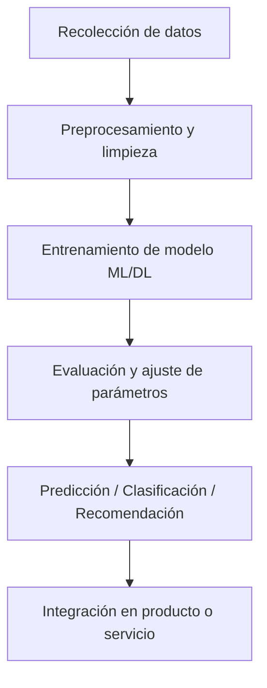

# Regresión Lineal y Mínimos Cuadrados Ordinarios

[Regresión Lineal y Mínimos Cuadrados Ordinarios](https://www.youtube.com/watch?v=k964_uNn3l0&list=PL-Ogd76BhmcC_E2RjgIIJZd1DQdYHcVf0&index=5) video

- [mates](/uncategorized/mates/)
- [Data Science](/data%20science/data-science/)
- [Deep Learning](/data%20science/deep-learning/)
## Concepto
- La regresión lineal busca modelar la relación entre una variable dependiente $y$ (por ejemplo, valor de una vivienda) y una o varias variables independientes $x$ (por ejemplo, número de habitaciones, grado de criminalidad, cercanía a negocios).
- Permite predecir valores de salida incluso para casos no presentes en los datos originales.

## Regresión Lineal Simple
- Una única variable de entrada $x$.
- Ecuación de la recta:  
  $$y = a + b \cdot x$$  
  - $a$: término independiente (intersección con el eje y).  
  - $b$: pendiente de la recta (relación entre $x$ e $y$).
- Ejemplo: predecir el valor medio de una vivienda a partir del número de habitaciones.

## Regresión Lineal Múltiple
- Múltiples variables de entrada $x_1, x_2, x_3, ...$.  
  Ecuación general:  
  $$y = a + b_1 x_1 + b_2 x_2 + b_3 x_3 + ...$$
- Visualmente:  
  - Dos variables → plano en 3D.  
  - Más variables → hiperplanos en espacios multidimensionales.
- Cada dimensión representa una característica del fenómeno que se está modelando.

## Representación Vectorial
- Cada fila de la matriz de datos representa una observación.  
- Cada columna representa una característica (atributo).  
- Variables dependientes y parámetros se representan como vectores y matrices, lo que permite simplificar las ecuaciones y aprovechar operaciones matriciales para cálculos eficientes.
- Ejemplo vectorial:  
  $$Y = X \cdot \beta$$  
  Donde $Y$ es el vector de valores a predecir, $X$ la matriz de características, y $\beta$ el vector de parámetros.

## Mínimos Cuadrados Ordinarios (OLS)
- Objetivo: encontrar la recta (o hiperplano) que minimice la suma de los cuadrados de los errores.  
- Error para cada punto: diferencia entre el valor real y el predicho.  
- Función de coste:  
  $$J(\beta) = \sum_i (y_i - \hat{y}_i)^2$$
- La penalización cuadrática da más peso a los puntos más alejados de la recta.
- Ajuste de parámetros:
  - Modificar $a$ (intersección) y $b$ (pendiente) para minimizar la función de coste.
  - La combinación óptima de parámetros da el modelo que mejor se ajusta a los datos.

## Consideraciones
- La regresión lineal simple es útil cuando hay una sola variable predictora.  
- La regresión múltiple permite modelar fenómenos complejos con múltiples características.  
- La representación matricial es fundamental para escalabilidad y eficiencia en cálculos, especialmente al usar GPUs.
- La minimización de la función de coste mediante MCO garantiza el ajuste óptimo del modelo bajo el criterio de suma de cuadrados.

# IA NOTEBOOK 1: Regresión Lineal y Mínimos Cuadrados Ordinarios
[IA NOTEBOOK #1 | Regresión Lineal y Mínimos Cuadrados Ordinarios | Programando IA](https://www.youtube.com/watch?v=w2RJ1D6kz-o)

## Entorno Anaconda
- Añadir Anaconda al PATH del sistema para poder ejecutar `jupyter` desde la terminal.
- Jupyter Notebook / Jupyter Qt Console:
	- Permite crear cuadernos interactivos.
	- Posibilidad de documentar y escribir fórmulas con **LaTeX**.
	- [Documentación Qt Console para Jupyter](https://qtconsole.readthedocs.io/en/stable/index.html)
- Terminal Qt: interfaz avanzada de Jupyter para ejecutar código y explorar datos.
- Buenas prácticas: documentar celdas y organizar código en secciones.

## Notebook 1: Regresión Lineal
- Objetivo: ajustar una línea a la nube de puntos minimizando la función de coste.
- La recta ajustada será nuestro **modelo**.
- Usar matrices para representar datos de entrada y salida y calcular los parámetros de la recta.

### Librerías principales

```python
import numpy as np       # Cálculos numéricos: arrays, matrices, operaciones lineales.
import scipy as sc       # Extiende numpy con funciones avanzadas y procesamiento de datos.
import matplotlib.pyplot as plt  # Visualización gráfica.
```
`

- **numpy**: manejo eficiente de arrays y matrices, operaciones algebraicas.
- **scipy**: funciones matemáticas avanzadas, estadísticas, optimización, procesamiento de imágenes y señales.
- **matplotlib.pyplot**: crear gráficos, diagramas y visualizaciones; alternativas: seaborn, plotly.

### Dataset Boston Housing


```python
from sklearn.datasets import load_boston

# Cargar dataset
boston = load_boston()

# Explorar funciones disponibles
boston.  # presionar TAB para autocompletar
```


- `sklearn.datasets` incluye conjuntos de datos de ejemplo, como Boston Housing.
- Proceso típico:
    1. Recoger datos.
    2. Explorar estructura del dataset.
    3. Seleccionar variables independientes (X) y variable dependiente (y).
    4. Construir modelo de regresión lineal.

### Atajos y Tips en Jupyter

- `Ctrl + Enter`: ejecutar celda seleccionada.
- `Shift + Enter`: ejecutar celda y moverse a la siguiente.
- `In [n]`: indica el orden de ejecución de las celdas.
- `.` + `TAB`: autocompletado de métodos y atributos de objetos.

### Flujo de trabajo básico

1. Cargar y explorar datos (`boston.data`, `boston.target`).
2. Preparar matrices de entrada (X) y salida (y).
3. Ajustar modelo de regresión lineal usando **numpy** o librerías de aprendizaje supervisado.
4. Visualizar resultados con **matplotlib**.
5. Analizar errores y función de coste.

# Casos de Uso y Aplicaciones de Deep Learning y Machine Learning

## Procesamiento de Lenguaje Natural (PLN)
- **Casos de uso**:
	- Traducción automática de textos.
	- Análisis de sentimiento en redes sociales.
	- Chatbots y asistentes virtuales.
	- Resumen automático de documentos.
- **Aplicación práctica**:
	- Empresas de atención al cliente usan chatbots para responder consultas.
	- Plataformas como Google Translate usan modelos de traducción basados en transformers.
	- Análisis de opiniones de productos mediante modelos de clasificación de texto.

## Computer Vision
- **Casos de uso**:
	- Clasificación de imágenes.
	- Detección y reconocimiento de objetos.
	- Reconocimiento facial.
	- Segmentación semántica (identificación de regiones en imágenes).
- **Aplicación práctica**:
	- Cámaras de seguridad usan reconocimiento facial para identificar personas.
	- Industria automotriz aplica visión computacional para vehículos autónomos.
	- Diagnóstico médico: segmentación de órganos en imágenes de resonancia.

## Predicción y Análisis de Datos
- **Casos de uso**:
	- Predicción de precios de vivienda.
	- Forecasting financiero y de ventas.
	- Análisis de riesgo crediticio.
- **Aplicación práctica**:
	- Modelos de regresión lineal o regresión múltiple predicen precios inmobiliarios a partir de características de las propiedades.
	- Bancos usan modelos de ML para evaluar riesgo de clientes antes de otorgar créditos.

## Recomendaciones
- **Casos de uso**:
	- Sistemas de recomendación de productos, películas o música.
	- Personalización de contenido en plataformas digitales.
- **Aplicación práctica**:
	- Netflix y Spotify recomiendan contenido basado en historial de usuario y patrones de comportamiento.
	- E-commerce utiliza modelos de filtrado colaborativo para sugerir productos.

## Detección de Fraude y Seguridad
- **Casos de uso**:
	- Detección de transacciones fraudulentas.
	- Identificación de patrones anómalos en datos de sensores.
- **Aplicación práctica**:
	- Bancos aplican ML para detectar operaciones sospechosas en tiempo real.
	- Empresas de telecomunicaciones detectan intrusiones o fallos en redes.

## Reforzado y Automatización
- **Casos de uso**:
	- Juegos y simulaciones.
	- Robots autónomos y vehículos inteligentes.
	- Optimización de procesos industriales.
- **Aplicación práctica**:
	- Agentes de aprendizaje reforzado aprenden estrategias óptimas en videojuegos o simulaciones financieras.
	- Robots industriales ajustan sus movimientos y tareas según retroalimentación del entorno.
	- Algoritmos de optimización para minimizar costos energéticos en fábricas.

## Generación de Contenido
- **Casos de uso**:
	- Generación automática de imágenes, texto y audio.
	- Modelos generativos (GANs, transformers) para diseño y arte digital.
- **Aplicación práctica**:
	- Creación de imágenes sintéticas para videojuegos o marketing.
	- Generación de texto automático en asistentes de escritura.
	- Deepfakes y modelos de voz sintética en medios creativos.

## Ejemplo de Flujo General de Aplicación de ML/DL


`