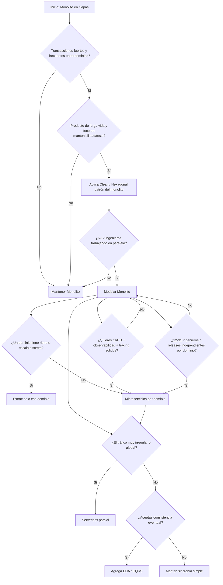

# Backend
`$= dv.current().file.tags.join(" ")`

## decision de arquitectura backend algoritmo mermaid





## Frameworks y Tools
- frameworks
	- [nestjs](/backend/nestjs/)  
	- [node.js](/backend/node-js/)  
	- [net](/software%20engineering/net/)  
	- [fastify](/backend/fastify/)  
	- [FastApi](/backend/fastapi/)  
	- [Springboot](/backend/springboot/)  
	- [java](/software%20engineering/java/)  
- Headless backend  
	- [poketbase](/backend/poketbase/)  
	- [strapi](/backend/strapi/)  
	- [Firebase](/backend/firebase/)  
	- supabase  
- [proxy](/backend/proxy/)  
	- [nginx](/backend/nginx/)  
	- [apache](/backend/apache/)  

### Notas sobre Frameworks
- *NestJS*: Framework modular basado en TypeScript, orientado a la arquitectura limpia y modular, integra inyección de dependencias, validadores, interceptores, y soporte completo para GraphQL y microservicios.
- *Fastify*: Alternativa ligera y veloz a Express; su enfoque en rendimiento y validación con JSON Schema lo hace ideal para microservicios.
- *Springboot*: Framework Java que simplifica la creación de aplicaciones empresariales; soporta inyección de dependencias, perfiles de configuración, seguridad y ORM con JPA.
- *Headless CMS*: Soluciones que exponen API REST o GraphQL para gestionar contenido desacoplado del frontend.

## Conceptos Fundamentales

- SOAP: Simple Object Access Protocol. Basado en XML, usado tradicionalmente en servicios empresariales.
- CSR: Client Side Rendering — renderizado del lado del cliente.
- SSR: Server Side Rendering — renderizado del lado del servidor.
- SSG: Static Site Generation — generación estática de contenido con [Motor de plantillas](/desarrollo%20web/motor-de-plantillas/).
- [api](/backend/api/): Punto de acceso estructurado para comunicación entre sistemas.
- [GraphQL](/backend/graphql/): Lenguaje de consulta para APIs, que permite solicitar solo los datos necesarios.
- [axios](/backend/axios/): Cliente HTTP basado en promesas.
- [tanstack](/backend/tanstack/)
- **HTTP**  
	- Cliente / servidor  
	- Requests / Responses  
	- Headers, status codes, métodos (GET, POST, PUT, PATCH, DELETE)  
	- PUT vs PATCH: reemplazo completo vs actualización parcial.
- **Endpoints**: Rutas de acceso definidas para las operaciones CRUD.
- **Streaming**: Transmisión continua de datos (por ejemplo, logs o eventos).
- **Validaciones**: Sanitización, verificación de tipos y estructuras.
- **Resumability**: Capacidad de reanudar procesos (por ejemplo, subidas interrumpidas).
- **Hydration**: Rehidratación del estado del cliente tras renderizado inicial SSR.
- **Detección de cambios**: Observadores o mecanismos reactivos que actualizan vistas automáticamente.
- **CRUD**: Create, Read, Update, Delete.
- **Concurrencia y Multihilos**: Ejecución paralela controlada de procesos en entornos backend.
- **Rutas y Fetching**: Mapeo de endpoints y obtención eficiente de datos.
- **Mixins (no JS)**: Patrón de reutilización de código a nivel de clases o servicios.

### Autenticación y Seguridad

- [autenticacion](/uncategorized/autenticacion/)  
	- [ciberseguridad](/uncategorized/ciberseguridad/)  
	- Hash de contraseñas  
		- bcrypt  
		- riesgo de truncamiento  
	- Cache key y sesiones  
	- Tokens (JWT, OAuth2)
	- Refresh tokens y expiración  
	- Roles y permisos granulares  
	- CSRF, XSS, y otras vulnerabilidades comunes

---

## Procesamiento de Datos

- [Stream Processing](/backend/stream-processing/): Procesamiento continuo de flujos de eventos en tiempo real (Kafka, Flink).
- Event Sourcing: Registro inmutable de eventos; ideal para sistemas auditables o distribuidos.
- Casos de uso: CQRS, auditorías, sistemas financieros, microservicios desacoplados.
- [gestor de colas](/backend/gestor-de-colas/)

---

## Arquitecturas Web
- [Patrones de diseño](/computer%20science/patrones-de-dise-o/)
- [microservicios](/backend/microservicios/): Arquitectura basada en componentes independientes y desplegables por separado.
- [monorepo](/backend/monorepo/): Repositorio único para múltiples servicios o librerías.
- [gestor de colas](/backend/gestor-de-colas/): Sistema para orquestar mensajes (RabbitMQ, Kafka, SQS).
- **CQRS y Event Sourcing**: Separación entre comandos y consultas, con persistencia basada en eventos.
- **Saga Pattern**: Coordinación de transacciones distribuidas mediante compensaciones.
- **Circuit Breaker**: Protección ante fallos en servicios dependientes.

---

## Protocolos de Comunicación
- [Comunicación entre Procesos](/computer%20science/comunicaci-n-entre-procesos/)
- [websockets](/backend/websockets/): Comunicación bidireccional en tiempo real.
- [webhooks](/backend/webhooks/): Notificaciones basadas en eventos HTTP.
- [web services](/backend/web-services/): Servicios accesibles a través de protocolos estándar.
- [api](/backend/api/): Comunicación estructurada entre sistemas.
- **gRPC**: Comunicación binaria eficiente sobre HTTP/2, útil para microservicios.
- **MQTT / AMQP**: Protocolos ligeros para mensajería IoT y backend distribuido.

---

## Diseño de Sistemas Backend

- [Databases](/uncategorized/databases/): Diseño, consultas y optimización.
- [CORS](/backend/cors/): Control de acceso entre orígenes.
- [server actions](/backend/server-actions/): Ejecución de lógica del servidor en frameworks híbridos.
- [serverless](/backend/serverless/): Arquitectura basada en funciones efímeras y escalables.
- [Runtime Management](/backend/runtime-management/): Supervisión de procesos, logs, y recursos.
- **Escalabilidad**  
	- [Instance Scaling](/backend/instance-scaling/): Escalado horizontal o vertical según demanda.
	- Autoescalado con métricas.
- **Cache y Almacenamiento**  
	- Cache distribuido (Redis, Memcached).  
	- Particionado (sharding) y replicación (master-slave).  
	- SQL vs NoSQL, elección según consistencia y disponibilidad.
- **Networking y Rendimiento**  
	- DNS, CDN, latencia, balanceo de carga.  
	- Optimización de peticiones a la base de datos.  
- **Seguridad Operacional**  
	- Manejo de secretos en runtime.  
	- Reinicio controlado de servicios.  
	- Observabilidad (metrics, tracing, logging).  

---

# Backend — Expansión Avanzada

## Patrones de Arquitectura Backend

- **Hexagonal Architecture (Ports and Adapters)**  
	- Aísla la lógica de negocio del entorno externo.  
	- Facilita pruebas unitarias y reemplazo de frameworks o bases de datos sin impacto en el dominio.  
	- Componentes: *Domain*, *Ports*, *Adapters*.  
- **Onion Architecture**  
	- Basada en capas concéntricas, donde el núcleo (dominio) no depende de capas externas.  
	- Promueve inversión de dependencias y testing aislado.  
- **Clean Architecture (Robert C. Martin)**  
	- Enfatiza independencia de frameworks, UI y bases de datos.  
	- Uso intensivo de *Use Cases*, *Entities*, *Interfaces* y *Gateways*.  
- **Event-Driven Architecture (EDA)**  
	- Componentes reaccionan a eventos asincrónicos en lugar de invocaciones directas.  
	- Común en sistemas distribuidos, IoT y microservicios desacoplados.  
- **Reactive Architecture**  
	- Basada en flujos de datos continuos y propagación de cambios.  
	- Ejemplo: *Project Reactor* (Java), *RxJS*, *Akka Streams*.  
---

## Persistencia y Bases de Datos Avanzadas

- **ACID vs BASE**  
	- *ACID*: Atomicidad, Consistencia, Aislamiento, Durabilidad.  
	- *BASE*: Basically Available, Soft state, Eventually consistent (orientado a escalabilidad).  

- **Indexación y Optimización de Consultas**  
	- Índices B-Tree, Hash, GIN, GiST, Full-text search.  
	- Uso de *EXPLAIN ANALYZE* para detectar cuellos de botella.  
- **Replicación y Sharding**  
	- *Replicación síncrona*: Alta consistencia, menor rendimiento.  
	- *Asíncrona*: Escalabilidad con posible lag.  
	- *Sharding*: División horizontal de datos entre nodos.  
- **Bases de Datos Time Series**  
	- Diseñadas para métricas, logs y eventos continuos (InfluxDB, TimescaleDB).  
- **Bases de Datos Orientadas a Grafos**  
	- Modelan relaciones complejas (Neo4j, ArangoDB).  
	- Usadas en sistemas de recomendación y detección de fraude.  

---

## Performance, Observabilidad y Resiliencia

- **Load Balancing**  
	- Distribución de carga mediante algoritmos como *Round Robin*, *Least Connections*, *IP Hash*.  
	- Capas: L4 (TCP/UDP) y L7 (HTTP).  

- **Caching Estratificado**  
	- *Local cache*: rápida pero no compartida.  
	- *Distributed cache*: compartida entre instancias.  
	- Estrategias: *Write-through*, *Write-back*, *Lazy loading*.  

- **Resiliencia y Fault Tolerance**  
	- *Retry & Backoff*, *Timeouts*, *Fallbacks*.  
	- Uso de patrones como *Bulkhead* y *Circuit Breaker*.  
	- Herramientas: *Resilience4j*, *Hystrix*.  

- **Tracing y Monitoring**  
	- Integración con *OpenTelemetry*, *Prometheus*, *Grafana*.  
	- *Metrics*: latencia, throughput, error rate.  
	- *Distributed tracing*: seguimiento de requests entre microservicios.  

---

## Despliegue, Escalabilidad y CI/CD

- **Infraestructura como Código (IaC)**  
	- Herramientas: Terraform, Pulumi, Ansible.  
	- Permite reproducir entornos de manera determinista.  

- **Containers y Orquestadores**  
	- [Docker](/software%20engineering/docker/): Aislamiento de servicios y dependencias.  
	- [Kubernetes](/virtualizacion/kubernetes/): Escalado automático, rolling updates, health checks.  

- **Pipelines CI/CD**  
	- Ejemplo de flujo:
		1. Build y test del código.  
		2. Análisis estático (lint, SonarQube).  
		3. Deploy automatizado en entornos staging/production.  
	- Estrategias de despliegue: *Blue-Green*, *Canary*, *Rolling*.  

- **Serverless vs Containers**  
	- *Serverless*: costo por ejecución, ideal para tareas eventuales.  
	- *Containers*: control total del runtime, adecuado para servicios persistentes.  

---

## Backend Distribuido y Colaborativo

- **Mensajería Asíncrona**  
	- *Message Brokers*: Kafka, RabbitMQ, NATS.  
	- *Pub/Sub*: desacopla productores y consumidores.  
	- *Dead Letter Queues*: manejo de eventos fallidos.  

- **Sagas y Compensaciones**  
	- Manejan consistencia eventual en transacciones distribuidas.  
	- Cada paso tiene su acción compensatoria.  

- **Idempotencia y Reintentos**  
	- Evita efectos secundarios en reintentos.  
	- Implementación: tokens únicos, control de estado de eventos.  

- **Distribución Geográfica y Latencia**  
	- Réplicas regionales y CDN dinámico.  
	- Edge computing para ejecutar funciones cerca del usuario.  

---

## Testing y Calidad Backend

- **Tipos de Pruebas**  
	- Unitarias: validan funciones aisladas.  
	- Integración: validan la interacción entre módulos.  
	- End-to-End (E2E): simulan escenarios reales con clientes y APIs.  

- **Mocking y Test Doubles**  
	- Uso de stubs, spies, y mocks para aislar dependencias.  

- **Contract Testing**  
	- Verificación de compatibilidad entre productor y consumidor de APIs (Pact).  

- **Load Testing**  
	- Herramientas: K6, JMeter, Locust.  
	- Métricas clave: RPS, percentiles de latencia, throughput.  

---

## Tópicos Emergentes

- **Edge Backend**  
	- Ejecución de funciones en nodos perimetrales (Cloudflare Workers, Vercel Edge).  
	- Beneficios: baja latencia, menor carga central.  

- **AI-Driven Backends**  
	- Integración de modelos de ML/IA en pipelines backend (ej. clasificación, recomendación).  
	- Frameworks: TensorFlow Serving, TorchServe.  

- **Zero Trust Architecture**  
	- Ninguna entidad es confiable por defecto.  
	- Autenticación continua, segmentación de red y políticas dinámicas.  

- **Data Mesh**  
	- Paradigma descentralizado para gestión de datos.  
	- Equipos autónomos gestionan sus propios *data products* con APIs estandarizadas.  

- **Temporal Workflows y Orquestación Avanzada**  
	- Frameworks: Temporal.io, Cadence.  
	- Permiten flujos de negocio duraderos y con reintentos automáticos.  

---

## Referencias y Expansiones Relacionadas

- Event Sourcing Patterns  
- CQRS y Microservicios  
- Resilience Patterns  
- Distributed Systems Testing  
- Serverless Patterns  
- Edge Computing  
- Temporal Orchestration  
- Data Mesh Architecture  


# Backend — Expansión Complementaria

## Seguridad Avanzada y Compliance

- **Zero Trust Networking (ZTN)**  
	- Todo acceso requiere verificación contextual.  
	- Autenticación continua basada en identidad y contexto (dispositivo, ubicación, rol).  
	- Integración con IAM (Identity Access Management) y políticas dinámicas.  

- **Seguridad en APIs**  
	- Rate limiting y throttling para evitar abuso.  
	- API Keys, OAuth2, JWT, Mutual TLS (mTLS).  
	- Validación de entrada estricta, filtrado de payloads y sanitización.  
	- Auditorías y logging de accesos sospechosos.  

- **Data Privacy y Cumplimiento Legal**  
	- Encriptación en tránsito (TLS) y en reposo (AES, RSA).  
	- GDPR / CCPA: anonimización, derecho al olvido, consent tracking.  
	- Control de acceso basado en roles (RBAC) y atributos (ABAC).  

- **Secrets Management**  
	- Vaults (HashiCorp Vault, AWS Secrets Manager).  
	- Rotación automática de claves y credenciales.  
	- Inyección de secretos en runtime mediante variables de entorno seguras.  

---

## Performance Tuning y Optimización Profunda

- **Optimización de I/O**  
	- Uso de *event loops* y *non-blocking I/O* (Node.js, Netty, Tokio).  
	- Multiplexación de conexiones y HTTP Keep-Alive.  
	- Compresión de respuestas (gzip, brotli).  

- **Parallel Processing**  
	- Thread pools, corutinas y workers.  
	- Balanceo entre CPU-bound y I/O-bound tasks.  
	- Patrones: *Fan-out/Fan-in*, *Work Stealing*, *Pipeline Processing*.  

- **Profiling**  
	- Identificación de cuellos de botella con APM (Application Performance Monitoring).  
	- Métricas de CPU, heap usage, GC, latencia.  
	- Herramientas: Jaeger, New Relic, Datadog, PySpy, Flamegraphs.  

---

## Gestión Avanzada de Estados y Sesiones

- **Stateful vs Stateless Services**  
	- Stateless: Escalables y fáciles de distribuir.  
	- Stateful: Mantienen contexto del usuario (requieren replicación o session stores).  

- **Session Stores**  
	- Redis, DynamoDB, Memcached.  
	- TTL dinámico y renovación automática.  
	- Seguridad mediante hashing y firmas digitales.  

- **Token Rotation y Revocación Dinámica**  
	- Previene robo de sesiones y replay attacks.  
	- Refresh tokens cortos y políticas de invalidación inmediata.  

---

## Gestión de Dependencias y Versionado

- **Versionado Semántico (SemVer)**  
	- `MAJOR.MINOR.PATCH` → Control preciso de compatibilidad.  
	- Cambios de API versionados en endpoints (`/v1/`, `/v2/`).  

- **Dependency Injection (DI)**  
	- Promueve modularidad y testabilidad.  
	- Implementaciones: *NestJS Container*, *Spring Context*, *InversifyJS*.  

- **Package Management y Monorepos**  
	- npm/yarn workspaces, Lerna, Nx.  
	- Versionado y releases coordinadas en múltiples paquetes.  

---

## Gestión de Logs y Auditoría

- **Estrategias de Logging**  
	- Estructurado (JSON) para análisis automatizado.  
	- Correlación de logs por *trace ID* o *request ID*.  

- **Log Aggregation**  
	- Centralización con *ELK Stack* (Elasticsearch, Logstash, Kibana) o *Loki*.  
	- Almacenamiento jerárquico (hot / warm / cold).  

- **Auditoría de Seguridad y Actividad**  
	- Registro de accesos críticos, cambios de configuración y errores de autenticación.  
	- Integración con SIEM (Security Information and Event Management).  

---

## Infraestructura Distribuida y Cloud-Native

- **Multi-Cloud y Hybrid Deployments**  
	- Estrategias de redundancia y portabilidad (Azure + AWS + GCP).  
	- Federaciones de Kubernetes y balanceo global (GSLB).  

- **Service Mesh**  
	- Control de tráfico y políticas entre microservicios (Istio, Linkerd).  
	- Observabilidad, seguridad mutua (mTLS) y *rate limiting* nativo.  

- **Sidecar Pattern**  
	- Desacopla funciones transversales (logging, auth, caching) del servicio principal.  

- **Infrastructure Observability**  
	- *Metrics*: CPU, memoria, red, I/O.  
	- *Tracing*: seguimiento distribuido entre servicios.  
	- *Logs*: correlación contextual con trazas y métricas.  

---

## Modelos de Comunicación Asíncrona y Eventual Consistency

- **Outbox Pattern**  
	- Garantiza entrega confiable de eventos tras confirmación de transacciones DB.  

- **Change Data Capture (CDC)**  
	- Replicación de cambios en tiempo real (Debezium, Kafka Connect).  

- **Command and Event Handlers**  
	- Separación clara entre comandos (acciones) y eventos (resultados).  
	- Implementaciones con *Domain Event Bus* o *Event Store*.  

- **Transactional Messaging**  
	- Mensajes atómicos entre bases de datos y colas (exactly-once delivery).  

---

## Procesamiento Batch y Offline

- **Batch Processing**  
	- Procesamiento periódico de grandes volúmenes de datos (ETL).  
	- Frameworks: Apache Beam, Spring Batch, Airflow.  

- **Data Pipelines**  
	- Orquestación de tareas dependientes.  
	- Persistencia intermedia y *checkpointing*.  

- **Backpressure y Control de Flujo**  
	- Limita la velocidad de producción/consumo para evitar saturación.  
	- Mecanismos: Reactive Streams, Flow Control Tokens.  

---

## Interoperabilidad y API Evolution

- **HATEOAS y REST Maturity Levels**  
	- APIs auto-descriptivas que guían al cliente mediante enlaces.  

- **GraphQL Federation**  
	- Integración de múltiples esquemas bajo un gateway unificado.  

- **gRPC Reflection y Code Generation**  
	- Generación automática de clientes tipados en múltiples lenguajes.  

- **API Gateways Avanzados**  
	- Kong, Apigee, AWS API Gateway.  
	- Control de cuotas, autenticación y versionado dinámico.  

---

## Integraciones Complejas y Middleware

- **Orquestación vs Coreografía**  
	- *Orquestación*: control centralizado de flujo (ej. Saga Orchestrator).  
	- *Coreografía*: eventos distribuidos sin coordinador.  

- **Middleware Pattern**  
	- Cadenas de responsabilidad que modifican requests/responses.  
	- Ejemplo: validación, logging, CORS, autenticación.  

- **Pipeline Processing Pattern**  
	- Flujo de procesamiento modular, encadenando transformaciones o validaciones.  

---

## Observabilidad Predictiva y AIOps

- **AIOps (AI for Operations)**  
	- Uso de ML para detectar anomalías en métricas de backend.  
	- Predicción de fallos o degradaciones antes de que ocurran.  

- **Dynamic Scaling basado en ML**  
	- Ajuste de recursos según patrones de tráfico predictivos.  

- **Self-Healing Systems**  
	- Reinicio automático de servicios fallidos.  
	- Redistribución de carga y reparación sin intervención humana.  

---

## Integraciones Futuras y Meta Backend

- **Backend for Frontend (BFF)**  
	- Capa intermedia adaptada a cada cliente (web, móvil, IoT).  
	- Reduce carga del frontend y mejora performance percibida.  

- **Composable Backends**  
	- APIs componibles que integran servicios modulares vía SDKs o GraphQL Federation.  

- **Data-Driven APIs**  
	- Generación automática de endpoints basada en esquemas o metadatos.  

- **API Contracts Autogenerados**  
	- Uso de OpenAPI/Swagger, AsyncAPI, o GraphQL SDL para documentación viva.  

- **Quantum-Ready Backends (exploratorio)**  
	- Adaptación a futuros sistemas híbridos (clásico + cuántico).  
	- Ejemplo: servicios de preprocesamiento y envío de tareas cuánticas en la nube.  

---

## Enlaces Relacionados

- Resilience4j Patterns  
- Service Mesh Architecture  
- Backend Observability  
- API Evolution  
- Event-Driven Design  
- Security Zero Trust  
- Infrastructure as Code  
- AIOps y Autoescalado  
- Composable API Patterns


# omnivore Backend

```base
type: list
name: "Notas con #backend en Omnivore"
order:
  - property: date_saved
    direction: desc
columns:
  - file.name
  - date_saved
filters:
  and:
    - file.inFolder("Omnivore")
    - file.hasTag("Backend", "backend")
views:
  - type: table
    name: Table
    sort:
      - property: file.mtime
        direction: DESC

```



