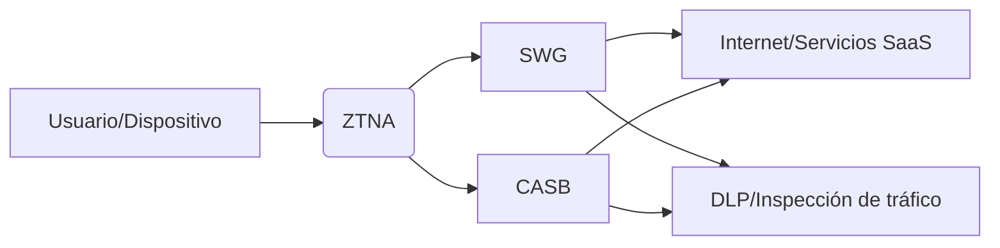
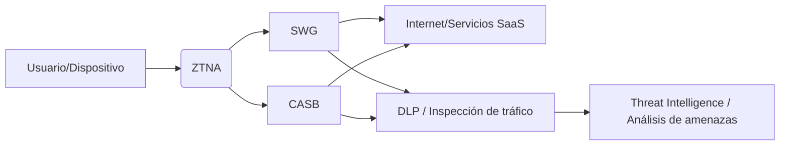

# Secure Service Edge SSE

Secure Service Edge (SSE) es un componente crítico dentro de la arquitectura [SASE](/ciberseguridad/sase/) (Secure Access Service Edge), centrado en la seguridad de acceso a servicios y datos desde la nube, independientemente de la ubicación del usuario o del dispositivo. Su objetivo principal es garantizar conectividad segura, inspección de tráfico y control de accesos en entornos híbridos y multi-nube.

## Conceptos Clave

- **Definición:** SSE se enfoca en la seguridad de los servicios y datos en la nube, separando la función de conectividad segura de la red física.
- **Componentes Principales:**
	**Secure Web Gateway (SWG):** Filtra y monitorea el tráfico web saliente para prevenir amenazas, malware y fugas de datos.
	**Cloud Access Security Broker (CASB):** Asegura el uso de aplicaciones SaaS, aplicando políticas de seguridad, control de acceso y detección de riesgos.
	**Zero Trust Network Access (ZTNA):** Proporciona acceso seguro a aplicaciones y servicios específicos sin exponer la red completa, basado en la verificación continua de identidad y contexto.
	**Data Loss Prevention (DLP):** Previene la fuga de información sensible desde cualquier dispositivo hacia la nube.
	**Threat Intelligence y Análisis de Tráfico:** Inspecciona y analiza el tráfico en busca de comportamientos maliciosos, ataques y vulnerabilidades.

## Beneficios

- **Seguridad Unificada:** Integración de SWG , [CASB](/ciberseguridad/casb/), [ZTNA](/ciberseguridad/ztna/) y [DLP](/ciberseguridad/dlp/)  para proteger usuarios, dispositivos y datos en la nube.
- **Visibilidad Centralizada:** Monitoreo y control del tráfico, aplicaciones y accesos desde una única consola.
- **Reducción de Superficie de Ataque:** Limita la exposición de servicios mediante políticas de acceso granular basadas en Zero Trust.
- **Escalabilidad:** Adaptable a entornos híbridos y multi-nube, soportando crecimiento de usuarios y servicios.
- **Cumplimiento Normativo:** Ayuda a cumplir estándares de seguridad y privacidad mediante auditorías y control de datos.

## Integración con [cloud](/cloud/cloud/) y [Virtualizacion](/devops/virtualizacion/)

- SSE se complementa con estrategias de [hardening](/ciberseguridad/hardening/) y orquestación de entornos virtualizados.
- Garantiza que aplicaciones y servicios desplegados en [cloud](/cloud/cloud/) pública, privada o híbrida mantengan políticas de seguridad consistentes.
- La combinación con [Virtualizacion](/devops/virtualizacion/) permite segmentación de tráfico y control granular en entornos virtualizados y contenedorizados.

## Ejemplo de Arquitectura SSE



`

## Referencias y Recursos

- [Qué es Secure Service Edge (SSE)](https://www.checkpoint.com/es/cyber-hub/network-security/what-is-secure-access-service-edge-sase/what-is-security-service-edge-sse/)
- [hardening](/ciberseguridad/hardening/)
- [cloud](/cloud/cloud/)
- [Virtualizacion](/devops/virtualizacion/)
- Orquestación de políticas de seguridad y accesos

# Secure Service Edge SSE – Nota Expandida

Secure Service Edge (SSE) es un componente fundamental dentro de la arquitectura [SASE](/ciberseguridad/sase/), enfocado en la **seguridad de acceso a servicios y datos en la nube**, independientemente de la ubicación del usuario o del dispositivo. A diferencia de [SASE](/ciberseguridad/sase/) completo, SSE se centra exclusivamente en la capa de seguridad, dejando la conectividad de red (SD-WAN, WAN optimizada) como opcional.

## Evolución y Relación con SASE

- SSE surge como evolución de SASE, cuando se identificó que muchos entornos necesitaban **seguridad en la nube sin depender de la red corporativa**.
- Diferencia clave:  
	tab**SASE:** combina seguridad (SSE) + conectividad optimizada (SD-WAN).  
	tab**SSE:** se enfoca solo en seguridad: SWG, CASB, ZTNA y DLP, dejando la red a cargo de otras soluciones.

## Componentes Principales

- **Secure Web Gateway (SWG):** Filtra tráfico web saliente para prevenir malware, phishing y fugas de datos.
- **Cloud Access Security Broker (CASB):** Controla el uso seguro de aplicaciones SaaS, aplicando políticas de seguridad y detección de riesgos.
- **Zero Trust Network Access (ZTNA):** Acceso seguro a aplicaciones específicas mediante verificación continua de identidad y contexto.
- **Data Loss Prevention (DLP):** Previene la fuga de información sensible desde cualquier dispositivo hacia la nube.
- **Threat Intelligence y Análisis de Tráfico:** Inspección profunda de tráfico y detección de comportamientos maliciosos, incluyendo ataques cero-day.

## Modelos de Despliegue

- **Cloud-Nativo:** SSE completamente ofrecido como servicio cloud por proveedores de seguridad.  
- **Híbrido/On-Premise:** Componentes de SSE desplegados en datacenters locales y sincronizados con la nube.  
- **Gestionado por Terceros:** Proveedores administran la seguridad de extremo a extremo, ideal para organizaciones sin infraestructura interna.

## Políticas de Acceso y Control Avanzado

- Basadas en **Zero Trust**, evaluando:  
	tab**Identidad del usuario** (empleado, tercero, temporal).  
	tab**Dispositivo** (corporativo, BYOD, nivel de seguridad).  
	tab**Ubicación y red** (corporativa, remota, pública).  
	tab**Contexto y riesgo en tiempo real** (anomalías de comportamiento, reputación IP).  
- Permiten **microsegmentación** de acceso a servicios SaaS o aplicaciones críticas.

## Inspección y Filtrado Avanzado

- **Deep Packet Inspection (DPI):** analiza contenido y protocolos en todos los niveles de la pila TCP/IP.  
- **Sandboxing:** ejecución de archivos sospechosos en entornos aislados para detectar malware avanzado.  
- **Prevención de amenazas cero-day:** uso de inteligencia de amenazas y machine learning para detectar ataques desconocidos.

## Integración con Identidades y Directorios

- Integración con sistemas IAM como **Active Directory**, **Azure AD**, **Okta** u otros servicios de identidad cloud.  
- Autenticación multifactor y control de sesiones en tiempo real.  
- Aplicación de políticas basadas en **roles y atributos** del usuario.

## Beneficios

- **Seguridad Unificada:** Combina SWG, CASB, ZTNA y DLP en una plataforma centralizada.  
- **Visibilidad Total:** Monitoreo de aplicaciones, usuarios y tráfico desde una sola consola.  
- **Reducción de Superficie de Ataque:** Acceso granular y segmentado, limitando exposición de servicios.  
- **Escalabilidad y Flexibilidad:** Funciona en entornos híbridos y multi-nube.  
- **Cumplimiento Normativo:** Facilita auditorías y adherencia a estándares como GDPR, HIPAA o ISO 27001.

## Escenarios de Uso

- **Teletrabajo Seguro:** acceso controlado a aplicaciones corporativas desde cualquier ubicación.  
- **Protección de SaaS:** monitoreo de tráfico y control de uso de aplicaciones en la nube.  
- **Cumplimiento Normativo:** prevención de fuga de datos y supervisión de actividad de usuarios.

## Desafíos y Limitaciones

- Posible **latencia** en tráfico inspeccionado desde la nube.  
- Complejidad en **integración con sistemas legacy** o aplicaciones internas.  
- Dependencia de proveedor cloud para actualizaciones y disponibilidad.

## Tendencias Futuras

- SSE 2.0: integración con inteligencia artificial para detección proactiva de amenazas.  
- Convergencia completa con [SASE](/ciberseguridad/sase/) y SD-WAN.  
- Expansión de funciones de seguridad hacia entornos de **IoT y edge computing**.  

## Integración con [cloud](/cloud/cloud/) y [Virtualizacion](/devops/virtualizacion/)

- SSE garantiza políticas de seguridad consistentes en entornos [cloud](/cloud/cloud/) pública, privada o híbrida.  
- La integración con [Virtualizacion](/devops/virtualizacion/) permite segmentación de tráfico, control de acceso y microsegmentación en entornos virtualizados y contenedorizados.  
- Combinado con [hardening](/ciberseguridad/hardening/) y orquestación, mejora la protección de servicios críticos y reduce la superficie de ataque.

## Ejemplo de Arquitectura SSE



`

# Secure Service Edge (SSE) 2025 — Recursos Actualizados

## Informes y Reconocimientos 2025

- **Gartner® Magic Quadrant™ para SSE 2025**  
  Cloudflare fue nombrado en el *Magic Quadrant™ 2025 para Security Service Edge*, destacando su enfoque en Zero Trust, acceso seguro sin cliente y capacidades avanzadas de IA/monitorización global. [Cloudflare Blog](https://blog.cloudflare.com/es-es/cloudflare-sse-gartner-magic-quadrant-2025/?utm_source=chatgpt.com)

- **Reconocimiento de Proveedores Líderes**  
  Netskope ha sido reconocido por cuarto año consecutivo como **líder en el Magic Quadrant de Gartner para Security Service Edge (SSE)**, destacando su visión completa y capacidades de ejecución. [Interempresas](https://www.interempresas.net/TIC/Articulos/598792-Netskope-reconocida-cuarto-ano-consecutivo-lider-Magic-Quadrant-Gartner-Security-Service.html?utm_source=chatgpt.com)

- **Skyhigh Security en el Magic Quadrant 2025**  
  Skyhigh Security también ha sido incluida en el *Magic Quadrant 2025*, validando su enfoque en protección de datos y convergencia de funciones SSE. [Skyhigh Security](https://www.skyhighsecurity.com/es/industry-perspectives/skyhigh-security-named-in-the-2025-magic-quadrant-for-security-service-edge.html?utm_source=chatgpt.com)

- **Benchmark de Mercado SSE 2025**  
  El reporte *Security Service Edge (SSE) Company Benchmark Report 2025* analiza más de 100 empresas, destacando a líderes como Zscaler, Cisco y Palo Alto Networks, e identifica tendencias, crecimiento y adopción global de SSE, especialmente para entornos regulados y de trabajo remoto. [GlobeNewswire](https://www.globenewswire.com/news-release/2025/07/18/3118003/28124/en/Security-Service-Edge-SSE-Company-Benchmark-Report-2025-Top-Companies-Mapped-Based-on-Revenue-and-Strategic-Expansion.html?utm_source=chatgpt.com)

## Recursos de Proveedores y Soluciones

- **Skyhigh Security SSE – Plataforma Integrada**  
  La solución cloud-native de Skyhigh convergente protege datos en web, nube, correo electrónico y aplicaciones privadas, integrando SWG, CASB, ZTNA, DLP e incluso *Remote Browser Isolation* (RBI) en una sola plataforma con capacidades avanzadas de detección de amenazas. [Skyhigh Security](https://www.skyhighsecurity.com/es/products/security-service-edge.html?utm_source=chatgpt.com)

- **Microsoft Security – SSE explicado**  
  Microsoft describe SSE como un modelo que combina SWG, CASB, ZTNA y también **Firewall-as-a-Service (FWaaS)** para asegurar acceso y datos en entornos distribuidos, simplificando la gestión de seguridad y cumplimiento mediante un enfoque cloud. [Microsoft](https://www.microsoft.com/en-us/security/business/security-101/what-is-security-service-edge-sse?utm_source=chatgpt.com)

- **Cisco Secure Service Edge (SSE)**  
  Cisco ofrece una plataforma que consolida ZTNA, SWG, CASB, firewall cloud, DNS-layer security, DLP y RBI para proteger entornos hiperdistribuidos con controles granulares y políticas unificadas. [Cisco](https://www.cisco.com/site/in/en/solutions/security-service-edge-sse/index.html?utm_source=chatgpt.com)

- **Zscaler SSE — Cloud Native Edge Security**  
  Zscaler promueve su *Zero Trust Exchange* como arquitectura SSE cloud-native escalable, permitiendo inspección inline, aplicación de políticas y reducción de complejidad mediante una plataforma multitenant. [Zscaler](https://www.zscaler.com/es/products-and-solutions/security-service-edge-sse?utm_source=chatgpt.com)

- **Nomios Group — Explicación y Beneficios SSE**  
  Nomios destaca que las soluciones SSE construidas para la nube ofrecen flexibilidad, protección de datos, prevención de amenazas, SWG y FWaaS con experiencia de usuario optimizada y gestión centralizada. [Nomios](https://www.nomios.com/security/sse/?utm_source=chatgpt.com)

## Temas y Tendencias Relevantes en 2025

- **Énfasis en Zero Trust y Acceso Contextual**  
  Las plataformas SSE continúan implantando principios de confianza cero y acceso basado en identidad y contexto para reforzar seguridad en redes distribuidas y conexiones remotas. [Microsoft](https://www.microsoft.com/en-us/security/business/security-101/what-is-security-service-edge-sse?utm_source=chatgpt.com)

- **Integración de Firewall-as-a-Service (FWaaS)**  
  FWaaS aparece cada vez más como componente estándar dentro de SSE junto a SWG, CASB y ZTNA para ampliar la protección de tráfico y políticas. [Microsoft](https://www.microsoft.com/en-us/security/business/security-101/what-is-security-service-edge-sse?utm_source=chatgpt.com)

- **Impulso del Rendimiento y Experiencia de Usuario**  
  Algunos proveedores optimizan la experiencia mediante arquitecturas globales de baja latencia, inspección distribuida y capacidades de monitorización avanzada para reducir tiempos de respuesta. [Cloudflare Blog](https://blog.cloudflare.com/es-es/cloudflare-sse-gartner-magic-quadrant-2025/?utm_source=chatgpt.com)

- **Crecimiento del Mercado y Adopción Empresarial**  
  El mercado SSE está creciendo rápidamente debido a la demanda de seguridad cloud-native, cumplimiento regulatorio y soporte para fuerzas de trabajo remotas e híbridas. [GlobeNewswire](https://www.globenewswire.com/news-release/2025/07/18/3118003/28124/en/Security-Service-Edge-SSE-Company-Benchmark-Report-2025-Top-Companies-Mapped-Based-on-Revenue-and-Strategic-Expansion.html?utm_source=chatgpt.com)

## Comparativas y Casos de Uso

- **Elección de Proveedor SSE en 2025**  
  En discusiones técnicas se observa que organizaciones evalúan proveedores SSE con criterios como integración con SD‑WAN, capacidades de *policy escape*, rendimiento y soporte para workloads híbridos, mostrando que la selección de plataforma sigue siendo clave para implementar SSE de forma efectiva. [Reddit](https://www.reddit.com//r/networking/comments/1mduixj?utm_source=chatgpt.com)

## Recursos de Aprendizaje

- **Learning Maps SSE / SASE (Cisco Live 2025)**  
  Cisco Live ofrece mapas de aprendizaje para entender SSE dentro de la estrategia SASE, útiles para capacitaciones y diseño de soluciones de seguridad modernas. [Cisco Live](https://www.ciscolive.com/global/learn/learning-maps/security/sase-security-service-edge-sse.html?utm_source=chatgpt.com)

## Referencias Clave

- Informe 2025 Gartner® Magic Quadrant™ para SSE  
- Soluciones y documentación de **Cloudflare**, **Skyhigh Security**, **Netskope**, **Cisco**, **Microsoft Security** y **Zscaler**  
- *Security Service Edge Company Benchmark Report 2025*

# SSE – Recursos Open‑Source y Repositorios GitHub (2025)

## Repositorios y Proyectos Relevantes

- **[OpenZiti (openziti/ziti)](https://github.com/openziti/ziti)** – Proyecto open‑source para crear redes overlay con **Zero Trust** y conectividad segura sin VPN tradicional. Ofrece componentes para controladores, routers y servicios que permiten aplicar políticas de acceso basadas en identidad y contexto.

- **[Pomerium](https://github.com/pomerium/pomerium)** – Proxy de acceso con contexto de identidad para **[ZTNA](/ciberseguridad/ztna/)** (Zero Trust Network Access). Permite conexiones seguras *clientless* a aplicaciones internas sin uso de VPN, aplicando confianza basada en identidad y políticas.

- **[OpenZiti SDKs](https://github.com/openziti)** – Conjunto de SDKs para distintos lenguajes (Go, Python, C, Node.js, JVM) que permiten integrar conectividad Zero Trust directamente en aplicaciones. Ejemplos:  
	**[openziti/ziti-sdk-golang](https://github.com/openziti/ziti-sdk-golang)**  
	**[openziti/ziti-sdk-py](https://github.com/openziti/ziti-sdk-py)**  
	**[openziti/ziti-sdk-nodejs](https://github.com/openziti/ziti-sdk-nodejs)**  
	**[openziti/ziti-sdk-c](https://github.com/openziti/ziti-sdk-c)**

## Proyectos Relacionados con Zero Trust / ZTNA

- **Repositorios por tópico “zero‑trust”** *(GitHub Topics que agrupan docenas de proyectos)* – Muestra múltiples herramientas y sistemas con enfoques Zero Trust que pueden ser combinados o servidos como componente SSE. [GitHub Topics](https://github.com/topics/zero-trust)

- **Repositorios por tópico “zero‑trust‑network‑access”** – Lista de proyectos orientados a ZTNA, incluyendo clientes y proxies *open‑source*. [GitHub Topics](https://github.com/topics/zero-trust-network-access)

- **[Netmaker](https://github.com/gravitl/netmaker)** – Sistema de redes VPN/mesh basado en WireGuard para crear redes seguras peer‑to‑peer con enfoque Zero Trust.

- **[immudb](https://github.com/codenotary/immudb)** – Base de datos inmutable que puede ayudar en sistemas SSE para auditoría y registro seguro de eventos (no es SSE por sí sola, pero útil).

## Herramientas Adicionales Útiles en Contexto SSE

- **[Teleport](https://github.com/gravitational/teleport)** – Proporciona acceso Zero Trust a servidores, clusters Kubernetes y recursos mediante proxy seguro y autenticación fuerte.

- **[privacyIDEA](https://github.com/privacyidea/privacyidea/)** – Sistema open‑source de autenticación multifactor (2FA / OTP) que puede complementar políticas Zero Trust en SSE.

- **[PacketFence](https://github.com/inverse-inc/packetfence)** – Control de acceso a la red (*NAC*) y aislamiento de dispositivos, ayuda con segmentación y cumplimiento antes de permitir acceso seguro.

## Ejemplos de Conceptos y Recursos Relacionados

- **[Awesome Zero Trust](https://github.com/pomerium/awesome-zero-trust)** – Lista curada de recursos que reúne muchas herramientas y proyectos en torno a Zero Trust, útil para diseñar una pila SSE open‑source.

## ¿Cómo combinar estos recursos?

- **OpenZiti + Pomerium:**  
	Utiliza *OpenZiti* para construir una red overlay Zero Trust y túneles seguros para aplicaciones.  
	Complementa con *Pomerium* para ZTNA y acceso *clientless* a aplicaciones internas.

- **Netmaker / WireGuard:**  
	Crea redes privadas y mallas seguras integradas con políticas Zero Trust básicas.

- **Teleport + IAM + 2FA:**  
	Usa Teleport para accesos a infraestructura y servicios con autenticación robusta y registro de auditorías.

Estas combinaciones ayudan a construir una solución SSE **open‑source** que incorpore ZTNA, control de acceso, segmentación segura y monitoreo, acercándose a las capacidades de soluciones comerciales.  

*Los enlaces son a proyectos y repositorios GitHub disponibles a diciembre de 2025.*
