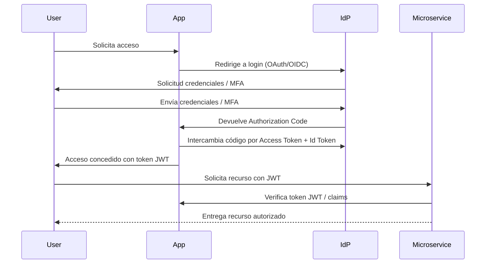
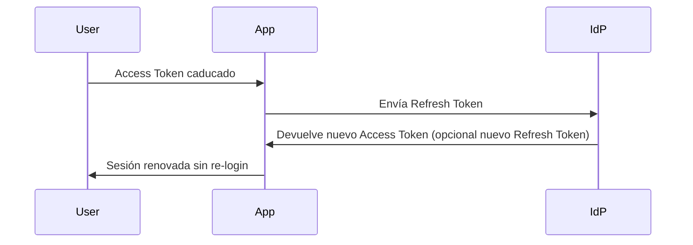
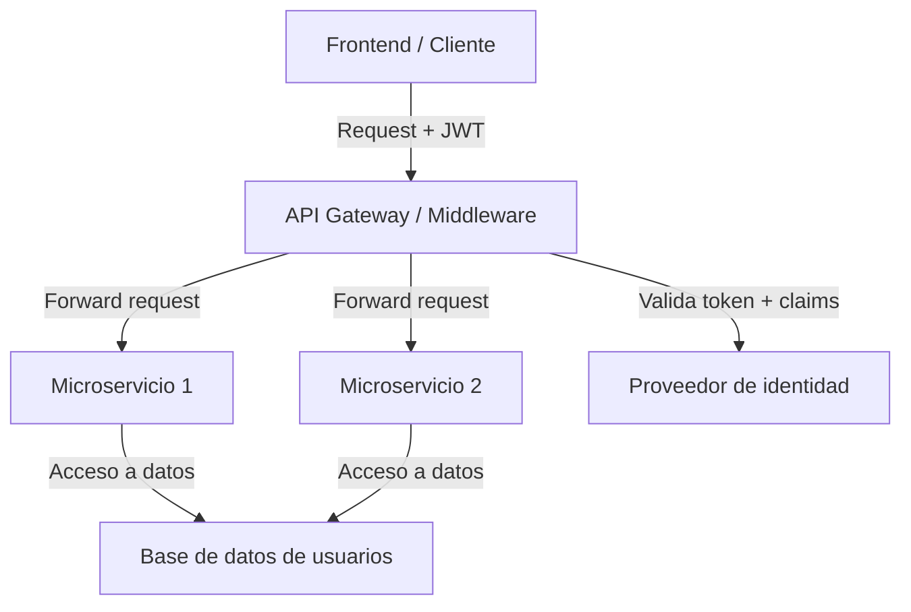
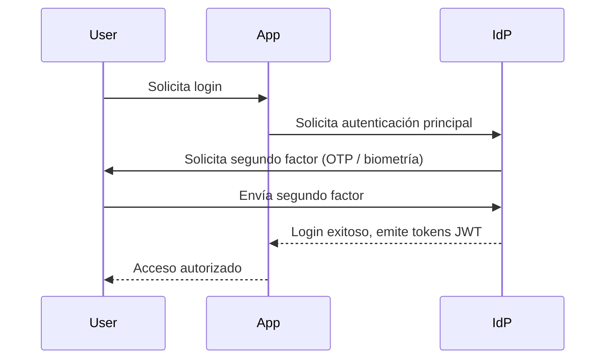
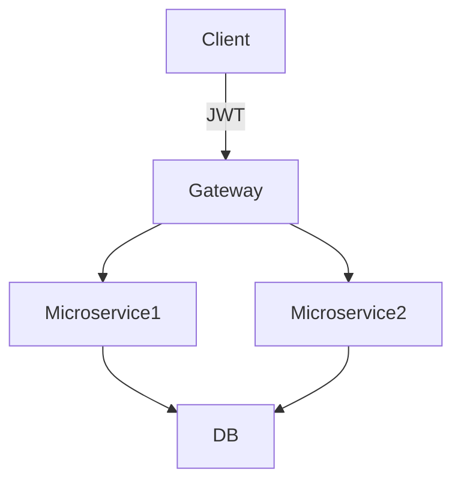

creation date: 2025-04-15 19:15
tags:
  - autenticacion
  - Hacking
  - criptografia
keywords:
source:
status: 🚀
Parent: "Area-Sistemas"
cssclasses:
  - hide-embedded-header1
categories: "[autenticacion](/uncategorized/autenticacion/)"
public_note: "true"
# Autenticación

- [criptografia](/autenticacion/criptografia/)
	- [PKI infraestructura de clave pública](/autenticacion/pki-infraestructura-de-clave-p-blica/)
- [ciberseguridad](/ciberseguridad/ciberseguridad/)
- [control de datos](/ciberseguridad/control-de-datos/)
- [Backend](/backend/backend/)
- [SSO Single Sign-On](/autenticacion/sso-single-sign-on/) 🔥
- [better auth](/autenticacion/better-auth/)
- [JWT](/autenticacion/jwt/)

## Conceptos clave
- **Autenticación:** proceso de verificar la identidad de un usuario o sistema.
- **Autorización:** determinar si un usuario tiene permiso para acceder a un recurso tras autenticarse.
- **Identidad digital:** conjunto de atributos que identifican a un usuario dentro de un sistema.
- **Single Sign-On (SSO):** permite a un usuario autenticarse una vez y acceder a múltiples servicios sin volver a iniciar sesión.
- **Federated Identity:** uso de identidades externas para autenticarse en un sistema, por ejemplo mediante [OAuth](/autenticacion/oauth/) o [SAML](/autenticacion/saml/).

## Metodologías de control de acceso
- [IAM Gestión de Identidades y Acceso](/autenticacion/iam-gesti-n-de-identidades-y-acceso/): gestión de identidades y accesos.
- [RBAC](/autenticacion/rbac/): control basado en roles; los permisos se asignan según el rol del usuario.
- [ABAC](/autenticacion/abac/): control basado en atributos; los permisos dependen de atributos de usuario, recurso y entorno.
- **Política de mínimo privilegio:** los usuarios solo reciben los permisos estrictamente necesarios.

## Métodos y protocolos estándar
- [LDAP](/autenticacion/ldap/): directorio para gestión de usuarios y grupos, común en [Windows Server](/devops/windows-server/) AD.
- [SAML](/autenticacion/saml/): estándar XML para intercambio de datos de autenticación y autorización entre dominios.
- [TACACS](/autenticacion/tacacs/): protocolo de autenticación para terminales de red.
- [RADIUS](/autenticacion/radius/): protocolo de autenticación remoto, común en redes y telefonía.
- [OAuth](/autenticacion/oauth/): protocolo de autorización para acceso seguro a recursos sin compartir credenciales.
- [JWT](/autenticacion/jwt/): tokens de acceso basados en JSON para autenticación y autorización.
- 2FA: autenticación de dos factores, combinando algo que sabes y algo que tienes.
- IdP: proveedor de identidad, encargado de autenticar usuarios y emitir tokens.

## Middleware y servicios adicionales
- midleware de autenticación para aplicaciones web.
- [Firebase](/backend/firebase/) Authentication: servicio gestionado de autenticación para apps web y móviles.
- Integración con [SSO Single Sign-On](/autenticacion/sso-single-sign-on/) y protocolos modernos como [OAuth](/autenticacion/oauth/) y [JWT](/autenticacion/jwt/) para mejorar seguridad y experiencia de usuario.

## Buenas prácticas
- Uso de contraseñas fuertes y políticas de expiración.
- Encriptación de credenciales y datos sensibles.
- Implementación de monitoreo y auditoría de accesos.
- Integración de métodos multifactor (2FA, biometría).
- Actualización continua de protocolos y servicios para evitar vulnerabilidades.
## Ejemplo de aplicación web con autenticación
- [GitHub - fazt/mern-crud-auth: A web CRUD application with Authentication using MERN Stack (Mongodb, Express, React, Nodejs)](https://github.com/fazt/mern-crud-auth)
- [YouTube MERN todo app](https://youtu.be/NmkY4JgS21A?t=16015)

# Autenticación Avanzada

- [OAuth](/autenticacion/oauth/)
- [JWT](/autenticacion/jwt/)
- [SSO Single Sign-On](/autenticacion/sso-single-sign-on/)
- 2FA
- IdP
- [ciberseguridad](/ciberseguridad/ciberseguridad/)
- control de acceso

## Flujos de autenticación OAuth
- **Authorization Code Flow:** recomendado para aplicaciones web con backend; el cliente obtiene un código de autorización que luego intercambia por un token de acceso.
- **Implicit Flow:** usado para aplicaciones SPA; obtiene el token directamente desde el servidor de autorización (menos seguro).
- **Client Credentials Flow:** usado por servicios o microservicios que necesitan autenticarse sin intervención del usuario.
- **Refresh Tokens:** permiten renovar tokens de acceso caducados sin volver a pedir credenciales al usuario.

## Tokens de acceso
- **JWT (JSON Web Token):** contiene información del usuario y permisos (claims); firmado digitalmente para verificar integridad.
- **Access Token:** token temporal que permite acceso a recursos protegidos.
- **Refresh Token:** token de larga duración usado para obtener nuevos access tokens.
- **Id Token:** en OpenID Connect, confirma la identidad del usuario.

## Single Sign-On ([SSO Single Sign-On](/autenticacion/sso-single-sign-on/)) y Federated Identity
- Permite a usuarios autenticarse una vez y acceder a múltiples aplicaciones.
- Integración con proveedores de identidad (IdP) mediante protocolos como [SAML](/autenticacion/saml/) y [OAuth](/autenticacion/oauth/).
- Mejora experiencia de usuario y reduce riesgos de contraseñas repetidas.

## Autenticación multifactor (MFA)
- Combina factores:
	- Algo que sabes (contraseña, PIN)
	- Algo que tienes (token, app de autenticación)
	- Algo que eres (biometría)
- Mejora significativamente la seguridad ante ataques de phishing o robo de credenciales.

## Flujos seguros en aplicaciones web
- Usar HTTPS para proteger tokens y credenciales.
- Almacenar tokens de forma segura (cookies HttpOnly o almacenamiento seguro del navegador).
- Implementar CSRF y validación de origen para evitar ataques.
- Revocar tokens comprometidos mediante listas negras o expiración corta.

## Integración con servicios y middleware
- [Firebase](/backend/firebase/) Authentication para gestión de usuarios y MFA integrada.
- Middleware de autenticación para APIs y microservicios:
	- Validación de JWT
	- Control de roles y permisos ([RBAC](/autenticacion/rbac/), [ABAC](/autenticacion/abac/))
	- Registro de eventos de acceso
- Uso combinado de [OAuth](/autenticacion/oauth/) + [JWT](/autenticacion/jwt/) para autorización delegada y escalable.

## Buenas prácticas avanzadas
- Rotación periódica de claves de firma para JWT.
- Monitoreo de patrones de login sospechosos y alertas automáticas.
- Implementar políticas de sesión y timeout adaptativas según riesgo.
- Segmentar permisos según principio de mínimo privilegio.
- Revisar vulnerabilidades en bibliotecas y servicios de autenticación externos.

## Ejemplo práctico avanzado
- Aplicación web con MERN Stack:
	- Implementa login con [OAuth](/autenticacion/oauth/) (Google/Facebook)
	- Uso de JWT para sesiones en frontend
	- Protección de rutas con middleware personalizado
	- Implementación de 2FA opcional para usuarios

# Autenticación Avanzada: Aspectos Complementarios

- [ciberseguridad](/ciberseguridad/ciberseguridad/)
- control de acceso
- [OAuth](/autenticacion/oauth/)
- [JWT](/autenticacion/jwt/)
- OpenID Connect
- FIDO2
- WebAuthn
- SCIM
- [SSO Single Sign-On](/autenticacion/sso-single-sign-on/)
- MFA

## Protocolos y estándares complementarios
- **OpenID Connect (OIDC):** extensión de OAuth 2.0 que agrega autenticación; emite **Id Tokens** para identificar usuarios.  
- **FIDO2 / WebAuthn:** autenticación sin contraseña mediante claves públicas y biometría; reduce riesgo de phishing y robo de credenciales.  
- **SCIM (System for Cross-domain Identity Management):** automatiza creación, actualización y eliminación de usuarios entre sistemas diferentes.  

## Seguridad y mitigación de riesgos
- **Ataques comunes:**
	- Phishing y spear-phishing
	- Brute-force y credential stuffing
	- Token theft y replay attacks
	- Session hijacking
- **Medidas avanzadas de mitigación:**
	- Rate limiting y bloqueo de IP tras intentos fallidos
	- Monitoreo de patrones de login sospechosos
	- Revocación de tokens comprometidos
	- Auditoría y logging detallado de eventos de autenticación

## Arquitectura y diseño
- **Autenticación centralizada:** todos los servicios delegan la verificación a un único proveedor.  
- **Autenticación distribuida:** cada servicio valida identidad, usual en microservicios; requiere coordinación de tokens y middleware.  
- **Gateways de API y middleware de seguridad:** validan tokens, roles y permisos antes de llegar a los microservicios.  

## Casos de uso avanzados
- Aplicaciones móviles con **refresh tokens** y almacenamiento seguro de credenciales.  
- SSO corporativo con múltiples IdP y federación de identidades.  
- Acceso basado en contexto: ubicación, dispositivo, hora, nivel de riesgo.  
- Tokens con alcance limitado (**scoped tokens**) para minimizar permisos por servicio.  

## Patrones de diseño de autenticación
- **Token introspection:** verificación centralizada del estado y validez de tokens.  
- **Scoped JWT claims:** uso de claims específicos para permisos finos y segmentados.  
- **Session management avanzada:** expiración adaptativa, revocación y renovación de sesiones según riesgo.  

## Buenas prácticas avanzadas
- Rotación periódica de claves de firma y certificados.  
- Integración de autenticación adaptativa basada en riesgos.  
- Uso de MFA combinado con factores contextuales.  
- Monitoreo activo de accesos y alertas automáticas ante anomalías.


# Autenticación Avanzada: Diagramas y Flujos

- [OAuth](/autenticacion/oauth/)
- [JWT](/autenticacion/jwt/)
- OpenID Connect
- [SSO Single Sign-On](/autenticacion/sso-single-sign-on/)
- MFA
- IdP
- Microservicios
- [ciberseguridad](/ciberseguridad/ciberseguridad/)

## Flujo de autenticación SSO con OAuth / OIDC



`

## Flujo de Refresh Tokens





## Arquitectura de autenticación distribuida para microservicios





## Flujo de MFA (2FA / biometría)





## Consideraciones avanzadas

- **Seguridad de tokens:** almacenar en cookies HttpOnly o almacenamiento seguro; siempre usar HTTPS.
- **Revocación y expiración:** mantener listas negras de tokens comprometidos.
- **Claims y scoped tokens:** definir permisos granulares por servicio o recurso.
- **Monitoreo y auditoría:** registrar eventos de login, revocación y uso de MFA.
- **Integración con múltiples IdP:** soportar federated identity y SSO corporativo.
# Autenticación Avanzada: Temas Complementarios

- [ciberseguridad](/ciberseguridad/ciberseguridad/)
- control de acceso
- [IAM Gestión de Identidades y Acceso](/autenticacion/iam-gesti-n-de-identidades-y-acceso/)
- Federated Identity
- Context-aware Authentication
- Privacidad
- Auditoría
- Riesgo

## Autenticación adaptativa (Context-aware)
- Ajusta el proceso de autenticación según riesgo y contexto:  
	- Ubicación geográfica del usuario  
	- Dirección IP y reputación del dispositivo  
	- Hora de acceso  
	- Tipo de red (pública, corporativa, VPN)  
- Permite activar MFA solo cuando se detecta actividad sospechosa.  

## Federated Identity Management
- Permite a usuarios usar una sola identidad para acceder a múltiples sistemas y dominios.  
- Interoperable mediante estándares como [SAML](/autenticacion/saml/), [OAuth](/autenticacion/oauth/) y OpenID Connect.  
- Reduce necesidad de múltiples credenciales y mejora la experiencia del usuario.  

## Gestión avanzada de identidades
- **Provisionamiento automatizado:** crear, actualizar y eliminar usuarios en sistemas conectados (SCIM).  
- **Delegación de permisos:** asignar temporalmente privilegios a usuarios o servicios específicos.  
- **Segregación de funciones (SoD):** evitar conflictos de interés mediante control de roles.  

## Privacidad y protección de datos
- Minimizar información sensible incluida en tokens (claims limitados).  
- Enmascaramiento de datos en logs y auditorías.  
- Cumplimiento con regulaciones: GDPR, CCPA, HIPAA.  

## Auditoría y monitoreo avanzado
- Registro de eventos críticos: logins exitosos, fallidos, MFA, revocación de tokens.  
- Análisis de patrones sospechosos: múltiples intentos desde distintas ubicaciones o dispositivos.  
- Alertas automáticas y reporte de incidentes de seguridad.  

## Gestión de riesgos
- Clasificación de usuarios y dispositivos por nivel de riesgo.  
- Sesiones adaptativas: mayor seguridad para usuarios de alto riesgo.  
- Políticas de expiración de tokens y revalidación periódica según riesgo.  

## Integración con microservicios y APIs
- Validación distribuida de tokens sin comprometer seguridad centralizada.  
- Uso de **claims dinámicos** para autorización granular basada en contexto y rol.  
- Implementación de gateways de seguridad para controlar accesos y auditar tráfico.  

Perfecto, aquí tienes una nota centrada **en técnicas de autenticación con ejemplos prácticos, algoritmos y snippets de programación**, lista para Obsidian:

# Autenticación: Técnicas y Ejemplos de Programación 1

- [OAuth](/autenticacion/oauth/)
- [JWT](/autenticacion/jwt/)
- 2FA
- [SSO Single Sign-On](/autenticacion/sso-single-sign-on/)
- MFA
- Hashing
- Criptografía
- Ciberseguridad
- [Firebase](/backend/firebase/)
- WebAuthn

## Técnicas de autenticación comunes

### 1. Autenticación con contraseñas
- **Hashing de contraseñas** con sal para proteger contra ataques de diccionario y rainbow tables.  
- Algoritmos recomendados: **bcrypt, scrypt, Argon2**.  

**Ejemplo en Python con bcrypt:**

```python
import bcrypt

# Crear hash de contraseña
password = b"mi_contraseña_segura"
salt = bcrypt.gensalt()
hashed = bcrypt.hashpw(password, salt)

# Verificar contraseña
if bcrypt.checkpw(password, hashed):
    print("Contraseña correcta")
else:
    print("Contraseña incorrecta")
```
`

### 2. Autenticación con tokens JWT

* Usado para sesiones sin estado (stateless).
* Contiene **claims**: información sobre usuario y permisos.
* Firmado con **HMAC** o **RSA** para garantizar integridad.

**Ejemplo en Node.js usando jsonwebtoken:**


```javascript
const jwt = require('jsonwebtoken');

const payload = { userId: 123, role: 'admin' };
const secret = 'mi_secreto';

const token = jwt.sign(payload, secret, { expiresIn: '1h' });

// Verificar token
try {
    const decoded = jwt.verify(token, secret);
    console.log(decoded);
} catch (err) {
    console.log('Token inválido');
}
```


### 3. Autenticación OAuth 2.0

* Permite **login delegando identidad** a un proveedor (Google, Facebook).
* Flujos comunes: Authorization Code Flow, Client Credentials Flow, Implicit Flow.

**Ejemplo conceptual en Python (Flask + requests):**


```python
from flask import Flask, redirect, request
import requests

app = Flask(__name__)

CLIENT_ID = 'tu_client_id'
CLIENT_SECRET = 'tu_client_secret'
REDIRECT_URI = 'http://localhost:5000/callback'
AUTH_URL = 'https://accounts.google.com/o/oauth2/auth'
TOKEN_URL = 'https://oauth2.googleapis.com/token'

@app.route('/login')
def login():
    return redirect(f"{AUTH_URL}?client_id={CLIENT_ID}&redirect_uri={REDIRECT_URI}&response_type=code&scope=email")

@app.route('/callback')
def callback():
    code = request.args.get('code')
    r = requests.post(TOKEN_URL, data={
        'code': code,
        'client_id': CLIENT_ID,
        'client_secret': CLIENT_SECRET,
        'redirect_uri': REDIRECT_URI,
        'grant_type': 'authorization_code'
    })
    token = r.json()
    return token
```


### 4. Autenticación multifactor (MFA / 2FA)

* Combinación de factores: contraseña + OTP o biometría.
* OTPs pueden generarse mediante **TOTP (Time-based One-Time Password)** usando librerías como `pyotp`.

**Ejemplo TOTP en Python:**


```python
import pyotp

# Generar secreto para usuario
secret = pyotp.random_base32()
totp = pyotp.TOTP(secret)

# Generar código OTP
otp = totp.now()
print("Código OTP:", otp)

# Verificar OTP
if totp.verify(otp):
    print("OTP válido")
else:
    print("OTP inválido")
```


### 5. Autenticación sin contraseña (Passwordless / WebAuthn / FIDO2)

* Uso de **claves públicas / privadas** y biometría.
* Ejemplo práctico usando **WebAuthn** se implementa en frontend con `navigator.credentials.create()` y backend con validación de firma pública.

### 6. Autenticación en apps móviles y web con Firebase

* Provee gestión de usuarios, login con correo/contraseña, OAuth y MFA.
* Ejemplo en JavaScript:


```javascript
import { getAuth, signInWithEmailAndPassword } from "firebase/auth";

const auth = getAuth();
signInWithEmailAndPassword(auth, email, password)
  .then((userCredential) => {
    console.log("Usuario autenticado:", userCredential.user);
  })
  .catch((error) => {
    console.error("Error de login:", error);
  });
```


## Buenas prácticas de programación en autenticación

* Nunca almacenar contraseñas en texto plano.
* Usar **HTTPS** siempre para proteger credenciales y tokens.
* Implementar expiración de tokens y refresh tokens seguros.
* Limitar intentos de login y aplicar **rate limiting**.
* Auditar accesos y registrar eventos críticos.
* Integrar MFA o factores contextuales para mayor seguridad.


Perfecto, aquí tienes una **versión extendida tipo “recetario completo de algoritmos de autenticación”**, organizada por técnica, con algoritmos, ejemplos de código, flujos y buenas prácticas. Lista para Obsidian:


# Recetario Completo de Algoritmos de Autenticación 2

- [OAuth](/autenticacion/oauth/)
- [JWT](/autenticacion/jwt/)
- 2FA
- [SSO Single Sign-On](/autenticacion/sso-single-sign-on/)
- MFA
- Hashing
- Criptografía
- FIDO2
- WebAuthn
- [Firebase](/backend/firebase/)
- Ciberseguridad
- Microservicios

## 1. Autenticación con contraseñas

### Algoritmos
- **Hashing seguro:** bcrypt, scrypt, Argon2
- **Salting:** agregar valor aleatorio único para cada usuario
- **Peppering:** valor secreto adicional conocido solo por servidor

### Ejemplo Python con bcrypt

```python
import bcrypt

password = b"mi_contraseña_segura"
salt = bcrypt.gensalt()
hashed = bcrypt.hashpw(password, salt)

# Verificación
if bcrypt.checkpw(password, hashed):
    print("Contraseña correcta")
```
`

### Flujo

1. Usuario ingresa contraseña
2. Servidor aplica hash + salt
3. Almacena hash en DB
4. Para login, se compara hash calculado con el almacenado


## 2. Autenticación con tokens JWT

### Algoritmos

* HMAC SHA256
* RSA / ECDSA (firma asimétrica)

### Ejemplo Node.js


```javascript
const jwt = require('jsonwebtoken');

const payload = { userId: 123, role: 'admin' };
const secret = 'mi_secreto';

const token = jwt.sign(payload, secret, { expiresIn: '1h' });

const decoded = jwt.verify(token, secret);
console.log(decoded);
```


### Flujo

1. Usuario se autentica
2. Servidor genera JWT firmado
3. JWT enviado al cliente
4. Cliente envía JWT en cada request
5. Servidor valida firma y claims para autorización


## 3. OAuth 2.0 y OpenID Connect (OIDC)

### Flujos comunes

* Authorization Code Flow (recomendado para web apps)
* Client Credentials Flow (servicios / microservicios)
* Implicit Flow (SPAs)
* Refresh Tokens

### Ejemplo conceptual Flask (Python)


```python
from flask import Flask, redirect, request
import requests

app = Flask(__name__)
CLIENT_ID = 'tu_client_id'
CLIENT_SECRET = 'tu_client_secret'
REDIRECT_URI = 'http://localhost:5000/callback'
AUTH_URL = 'https://accounts.google.com/o/oauth2/auth'
TOKEN_URL = 'https://oauth2.googleapis.com/token'

@app.route('/login')
def login():
    return redirect(f"{AUTH_URL}?client_id={CLIENT_ID}&redirect_uri={REDIRECT_URI}&response_type=code&scope=email")

@app.route('/callback')
def callback():
    code = request.args.get('code')
    r = requests.post(TOKEN_URL, data={
        'code': code,
        'client_id': CLIENT_ID,
        'client_secret': CLIENT_SECRET,
        'redirect_uri': REDIRECT_URI,
        'grant_type': 'authorization_code'
    })
    return r.json()
```



## 4. Autenticación multifactor (MFA / 2FA)

### Algoritmos

* TOTP (Time-based One-Time Password)
* HOTP (Counter-based OTP)
* Push notifications / biometría

### Ejemplo TOTP Python


```python
import pyotp

secret = pyotp.random_base32()
totp = pyotp.TOTP(secret)
otp = totp.now()
print("Código OTP:", otp)

if totp.verify(otp):
    print("OTP válido")
```


### Flujo

1. Usuario ingresa contraseña
2. Servidor solicita OTP
3. Usuario genera OTP con app o token físico
4. Servidor verifica OTP
5. Acceso concedido si ambos factores son correctos


## 5. Passwordless / FIDO2 / WebAuthn

### Algoritmos

* Criptografía de clave pública (asignación de keypair único por usuario)
* Firmas digitales para validar autenticación

### Flujo conceptual

1. Usuario registra dispositivo / clave pública
2. Servidor almacena clave pública
3. Para login, servidor envía desafío (challenge)
4. Usuario firma desafío con clave privada
5. Servidor valida firma con clave pública


## 6. Autenticación en aplicaciones móviles / web con Firebase

### Flujo

1. Usuario ingresa email/password o OAuth provider
2. Firebase gestiona verificación y emisión de tokens
3. Tokens se usan para acceder a recursos protegidos
4. Soporte integrado para MFA y passwordless

### Ejemplo JS


```javascript
import { getAuth, signInWithEmailAndPassword } from "firebase/auth";

const auth = getAuth();
signInWithEmailAndPassword(auth, email, password)
  .then(userCredential => console.log(userCredential.user))
  .catch(error => console.error(error));
```



## 7. Integración en microservicios

### Patrones

* **Gateway centralizado:** valida JWT y claims antes de enrutar a microservicios
* **Token introspection:** validación centralizada del estado del token
* **Scoped tokens:** permisos limitados a ciertos servicios o recursos

### Flujo conceptual






## Buenas prácticas de programación y seguridad

* Nunca almacenar contraseñas en texto plano
* Siempre usar HTTPS
* Tokens con expiración y refresh seguro
* Rate limiting y bloqueo ante múltiples intentos fallidos
* Auditoría de accesos críticos
* MFA / factores adaptativos según riesgo
* Rotación de claves y certificados para JWT y tokens
* Claims limitados y scoped tokens para autorización granular

# Implementaciones Avanzadas de Autenticación (Nuevas)

- Context-aware Authentication
- Adaptive Authentication
- Hardware Tokens
- Biometría
- FIDO2
- WebAuthn
- SSO Corporativo
- SCIM
- Zero Trust

## 1. Autenticación Adaptativa / Context-aware
- Ajusta los requisitos de autenticación según riesgo:
	- Ejemplo: usuario conectado desde ubicación inusual activa MFA
- Librerías / servicios:
	- **Auth0 Adaptive MFA**
	- **Okta Adaptive Authentication**
- Pseudocódigo:

```python
if user.location not in known_locations:
    require_mfa(user)
else:
    standard_login(user)
```
`

## 2. Hardware Tokens y Smart Cards

* Autenticación mediante dispositivos físicos (YubiKey, tarjetas inteligentes)
* Integración con **PKCS#11** para validación de certificados
* Ejemplo conceptual (Python + yubikey-manager):


```python
from yubikit.core import YubiKeyDevice
yk = YubiKeyDevice.connect()
challenge = generate_challenge()
response = yk.authenticate(challenge)
verify_response(response)
```


## 3. Biometría y autenticación local segura

* Integración con sistemas operativos:

  * **Windows Hello**, **Apple TouchID/FaceID**, **Android Biometric API**
* Flujo conceptual:

  1. Registrar biometría en dispositivo
  2. Crear clave criptográfica local ligada al factor biométrico
  3. Firmar challenge de servidor para autenticación

## 4. Zero Trust / Identity-aware proxy

* Enfoque donde **ningún acceso es confiable por defecto**
* Middleware o proxies validan identidad, contexto y permisos antes de cada request
* Ejemplo conceptual:


```javascript
function zeroTrustMiddleware(req, res, next) {
    if (!validateToken(req.headers.token)) return res.sendStatus(401);
    if (!checkDeviceCompliance(req.device)) return res.sendStatus(403);
    next();
}
```


## 5. SCIM / Provisionamiento automatizado

* Automatiza creación, actualización y eliminación de usuarios entre sistemas
* Ejemplo: sincronizar directorio corporativo con aplicación SaaS


```python
import requests
payload = {
    "schemas": ["urn:ietf:params:scim:schemas:core:2.0:User"],
    "userName": "usuario_nuevo",
    "emails": [{"value": "usuario@empresa.com"}]
}
requests.post("https://api.saas.com/scim/v2/Users", json=payload, headers=headers)
```


## 6. SSO corporativo avanzado

* Integración de múltiples IdPs y protocolos (SAML, OIDC, WS-Federation)
* Uso de assertion consumer service (ACS) para recibir tokens
* Ejemplo conceptual:


```javascript
app.post('/saml/acs', (req, res) => {
    const assertion = parseSAML(req.body.SAMLResponse);
    const user = mapAssertionToUser(assertion);
    loginUser(user);
});
```


## 7. Passwordless enterprise-ready

* Claves públicas/privadas + WebAuthn en web corporativa
* Integración con MFA opcional y registro de dispositivos confiables
* Flujo CE (Contextual & Enterprise):

  1. Usuario solicita login
  2. Servidor envía challenge a dispositivo registrado
  3. Dispositivo firma con clave privada ligada a biometría o PIN
  4. Servidor valida firma y registra contexto (dispositivo, ubicación)


```javascript
navigator.credentials.get({ publicKey: publicKeyOptions })
.then(assertion => sendToServer(assertion))
```


## 8. Buenas prácticas avanzadas CE

* Registrar contexto y dispositivo de cada login para auditoría
* Revisar riesgos adaptativamente y exigir MFA solo cuando necesario
* Integrar **hardware tokens + biometría + passwordless** para entornos de alta seguridad
* Automatizar provisionamiento y revocación de usuarios con SCIM
* Monitorear accesos y patrones sospechosos en tiempo real

# Glosario de Autenticación - Secciones Temáticas

## 1. Fundamentos de Autenticación y Autorización
- **Autenticación:** Verificación de identidad de un usuario o sistema.  
- **Autorización:** Definición de permisos para acceder a recursos tras autenticación.  
- **Identidad digital:** Conjunto de atributos que identifican a un usuario en un sistema.  
- **Single Sign-On (SSO):** Autenticación única para acceder a múltiples aplicaciones sin volver a loguearse.  
- **Federated Identity / Identity Federation:** Uso de identidades externas para acceder a diferentes sistemas.  
- **Principio de mínimo privilegio:** Usuarios solo reciben los permisos estrictamente necesarios.  
- **Segregación de funciones (SoD):** Evita conflictos de interés al asignar roles y permisos.  

## 2. Métodos de Autenticación
- **Contraseñas:** Factor clásico, requiere hashing seguro (bcrypt, Argon2, scrypt) y salting.  
- **MFA / 2FA:** Combinación de múltiples factores (algo que sabes, tienes o eres).  
- **TOTP / HOTP:** Algoritmos de OTP basados en tiempo o contador.  
- **Passwordless / WebAuthn / FIDO2:** Autenticación sin contraseña mediante claves públicas/privadas y biometría.  
- **Hardware Tokens / Smart Cards:** Dispositivos físicos que generan códigos o firman desafíos.  
- **Biometría:** Autenticación usando huella digital, rostro, voz u otros rasgos únicos.  
- **Context-aware / Adaptive Authentication:** Ajusta los requisitos de autenticación según riesgo, ubicación, dispositivo o comportamiento.  

## 3. Protocolos y Estándares
- **OAuth 2.0:** Protocolo de autorización delegada que permite acceso seguro a recursos.  
- **OpenID Connect (OIDC):** Capa de identidad sobre OAuth 2.0 que habilita autenticación y autorización.  
- **SAML:** Protocolo de intercambio seguro de información de autenticación y autorización.  
- **LDAP:** Protocolo para gestión de usuarios y grupos en directorios corporativos.  
- **SCIM:** Estándar para automatizar creación, actualización y eliminación de usuarios entre sistemas.  

## 4. Tokens y Gestión de Sesiones
- **JWT (JSON Web Token):** Token seguro y firmado que contiene claims de usuario y permisos.  
- **Access Token:** Token temporal que permite acceso a recursos protegidos.  
- **Refresh Token:** Permite renovar un Access Token sin pedir credenciales de nuevo.  
- **Id Token:** Emitido en OIDC para confirmar identidad del usuario.  
- **Claims:** Información dentro de un JWT usada para autorización y control de acceso.  
- **Scoped Tokens:** Tokens con permisos limitados a ciertos servicios o recursos.  
- **Token Introspection:** Validación centralizada del estado de un token en sistemas distribuidos.  

## 5. Arquitectura y Patrones
- **Autenticación centralizada:** Todos los servicios delegan verificación a un único proveedor.  
- **Autenticación distribuida:** Cada microservicio valida identidad y permisos; requiere coordinación de tokens.  
- **Gateway / API Gateway:** Middleware que valida tokens, roles y permisos antes de enrutar solicitudes.  
- **Zero Trust / Identity-aware Proxy:** Enfoque donde ningún acceso se considera confiable por defecto, y cada request es validado en contexto.  

## 6. Seguridad y Buenas Prácticas
- **Hashing seguro y salting de contraseñas**  
- **HTTPS obligatorio** para proteger credenciales y tokens  
- **Rotación periódica de claves** para JWT y certificados  
- **Auditoría y monitoreo de accesos**  
- **Rate limiting y bloqueo tras intentos fallidos**  
- **MFA y autenticación adaptativa** según riesgo  
- **Almacenamiento seguro de tokens** (cookies HttpOnly, almacenamiento seguro del navegador)  
- **Revocación de tokens comprometidos**  
- **Claims limitados y scoped tokens** para autorización granular  

## 7. Implementaciones y Herramientas
- **Firebase Authentication:** Gestión de usuarios, login con correo/contraseña, OAuth y MFA integrada.  
- **Auth0 / Okta / Azure AD:** Servicios para autenticación adaptativa, SSO corporativo y gestión de identidad.  
- **PKCS#11:** Estándar para integrar hardware tokens y smart cards.  
- **WebAuthn API:** Implementación de passwordless en navegadores modernos.  
- **Bibliotecas de Hashing:** bcrypt, Argon2, scrypt  
- **Librerías JWT:** jsonwebtoken (Node.js), PyJWT (Python)  
- **Middleware para microservicios:** Validación de JWT, claims, context-aware checks y Zero Trust enforcement.  

## 8. Casos de Uso Avanzados
- **Login adaptativo basado en contexto:** Ubicación, dispositivo, hora, red, historial de accesos  
- **SSO corporativo con múltiples IdPs** y federación de identidades  
- **Provisionamiento automatizado con SCIM** para aplicaciones SaaS  
- **Passwordless enterprise-ready** con WebAuthn + MFA + biometría  
- **Auditoría y alertas automáticas** en entornos de alta seguridad  

## 9. Conceptos Complementarios
- **Challenge / Response:** Validación de usuario mediante firma de un desafío.  
- **Credential Stuffing:** Ataque que utiliza combinaciones de usuario/contraseña robadas.  
- **Bearer Token:** Token que otorga acceso sin autenticación adicional.  
- **Minimum Privilege Principle:** Asignar solo los permisos estrictamente necesarios.  
- **Provisioning / De-provisioning:** Creación y eliminación de usuarios de manera automatizada.  
- **Scoped Claims / Tokens:** Tokens con permisos limitados a recursos específicos.  


