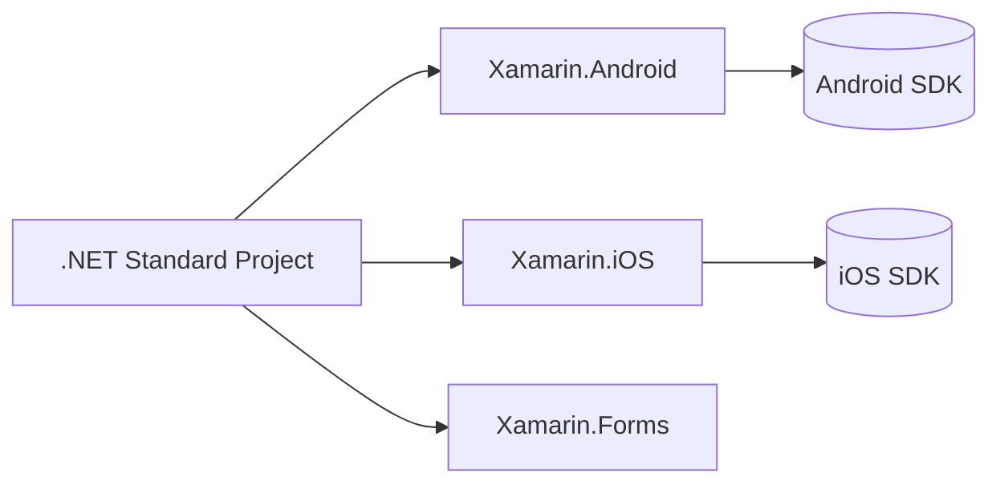

# xamarin
`$= dv.current().file.tags.join(" ")`

- [net](/software%20engineering/net/)
- [csharp](/software%20engineering/csharp/)
- [MAUI NET](/desarrollo%20multiplataforma/maui-net/)
- android
- Objective-C

## Descripción general
Xamarin es un **framework multiplataforma** basado en .NET que permite desarrollar **aplicaciones móviles nativas** para Android, iOS y otras plataformas utilizando C# y XAML.  
Fue una de las primeras soluciones que integraron el ecosistema .NET con el desarrollo móvil nativo, antes de la llegada de [MAUI NET](/desarrollo%20multiplataforma/maui-net/).

## Características principales
- **Lenguaje unificado:** permite desarrollar toda la lógica de la app en C#, reutilizando código entre plataformas.
- **XAML (Forms):** interfaz declarativa que simplifica la creación de UI compartidas (con `Xamarin.Forms`).
- **Framework antiguo:** aunque funcional, ha sido reemplazado por [MAUI NET](/desarrollo%20multiplataforma/maui-net/), que moderniza su arquitectura.
- **Acceso nativo:** expone APIs nativas de cada plataforma (Android, iOS, macOS, etc.) mediante *bindings*.
- **Compilación nativa:** genera código nativo optimizado, manteniendo el rendimiento cercano al de apps escritas en Objective-C o Java.

## Componentes principales
- **Xamarin.Android:** capa que permite usar el SDK nativo de Android desde C#.
- **Xamarin.iOS:** permite crear apps para iPhone y iPad usando C# con bindings a las APIs de iOS.
- **Xamarin.Forms:** framework de interfaz que permite compartir la UI entre plataformas con XAML.
- **Xamarin.Essentials:** biblioteca que proporciona acceso unificado a funcionalidades comunes del dispositivo (sensores, cámara, almacenamiento, etc.).

## Arquitectura
Xamarin se basa en el **Mono runtime**, una implementación de .NET compatible con diferentes sistemas operativos.  
La arquitectura típica incluye:
1. **Capa compartida (.NET Standard o PCL):** contiene la lógica de negocio común.
2. **Capa específica de plataforma:** implementa funciones nativas (por ejemplo, permisos, notificaciones, etc.).
3. **UI compartida (Forms):** definida en XAML y renderizada mediante *renderers* nativos en cada plataforma.



`

## Ciclo de vida y herramientas

* **IDE principal:** Visual Studio (Windows y macOS).
* **Depuración y simuladores:** integra emuladores nativos de Android/iOS.
* **Hot Reload:** permite actualizar la UI en tiempo real durante el desarrollo.
* **Herramientas de profiling:** ayudan a optimizar memoria y rendimiento.

## Ventajas

* Alta **reutilización de código** (hasta 90% entre plataformas).
* Acceso directo a las APIs nativas sin necesidad de código Java/Objective-C.
* Ecosistema maduro, con amplia documentación y soporte de Microsoft.
* Integración con Azure y otros servicios .NET.

## Limitaciones

* Renderizado más lento en comparación con [MAUI NET](/desarrollo%20multiplataforma/maui-net/) o nativo puro.
* Ciclo de desarrollo más largo en algunos casos (especialmente para UIs complejas).
* Dependencia de bindings nativos que requieren mantenimiento.
* Framework **en desuso**: reemplazado oficialmente por [MAUI NET](/desarrollo%20multiplataforma/maui-net/), aunque sigue siendo válido en proyectos heredados.

## Evolución hacia MAUI

Xamarin evolucionó a **.NET MAUI (Multi-platform App UI)**, una versión unificada del framework con una arquitectura más moderna:

* Código base compartido entre escritorio y móvil.
* Eliminación de *renderers*, reemplazados por *handlers*.
* Integración total con .NET 6+ y Blazor Hybrid.

## Recursos

* [¿Qué es Xamarin? - Xamarin | Microsoft Learn](https://learn.microsoft.com/es-es/previous-versions/xamarin/get-started/what-is-xamarin)
* [Xamarin.Forms Documentation](https://learn.microsoft.com/en-us/xamarin/xamarin-forms/)
* [Migrating from Xamarin.Forms to .NET MAUI](https://learn.microsoft.com/en-us/dotnet/maui/migration/)

