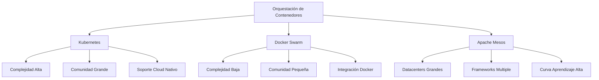

# Markdown Frontend Performance Optimization & Kubernetes


> *"La optimización sin medición es solo una suposición."* - Donald Knuth

## 📋 Índice de contenidos
- [Frontend Performance Optimization \& Kubernetes](#frontend-performance-optimization--kubernetes)
  - [📋 Índice de contenidos](#-índice-de-contenidos)
  - [Introducción](#introducción)
  - [Formatos de texto y decoraciones](#formatos-de-texto-y-decoraciones)
  - [¿Por qué Kubernetes es importante?](#por-qué-kubernetes-es-importante)
  - [Conceptos fundamentales](#conceptos-fundamentales)
    - [Arquitectura básica de Kubernetes](#arquitectura-básica-de-kubernetes)
    - [Integración con el desarrollo Frontend](#integración-con-el-desarrollo-frontend)
  - [Tipos de listas](#tipos-de-listas)
    - [Listas anidadas](#listas-anidadas)
  - [Ejemplo práctico](#ejemplo-práctico)
    - [Configuración de Kubernetes para una aplicación React](#configuración-de-kubernetes-para-una-aplicación-react)
    - [Código Ruby mencionado en el post original:](#código-ruby-mencionado-en-el-post-original)
    - [Optimización de JavaScript para entornos Kubernetes](#optimización-de-javascript-para-entornos-kubernetes)
  - [Comparativa con otras soluciones](#comparativa-con-otras-soluciones)
    - [Kubernetes vs. Alternativas](#kubernetes-vs-alternativas)
  - [Enlaces y referencias](#enlaces-y-referencias)
  - [Tablas avanzadas](#tablas-avanzadas)
  - [Bloques y elementos especiales](#bloques-y-elementos-especiales)
    - [Notas y advertencias](#notas-y-advertencias)
    - [Detalles expandibles](#detalles-expandibles)
  - [Mejores prácticas](#mejores-prácticas)
    - [Optimización de rendimiento Frontend en Kubernetes](#optimización-de-rendimiento-frontend-en-kubernetes)
  - [Conclusión](#conclusión)
  - [Recursos adicionales](#recursos-adicionales)
    - [📚 Libros recomendados](#-libros-recomendados)
    - [🔗 Enlaces útiles](#-enlaces-útiles)
    - [🎓 Cursos y certificaciones](#-cursos-y-certificaciones)
  - [Apéndice: Cheatsheet de Markdown](#apéndice-cheatsheet-de-markdown)

## Introducción

Este post explora detalladamente la relación entre **optimización de frontend** y cómo **Kubernetes** puede potenciar tus habilidades de desarrollo. En la actualidad, la integración de estas tecnologías representa un cambio paradigmático en cómo construimos aplicaciones modernas.

## Formatos de texto y decoraciones

El Markdown permite usar una gran variedad de formatos de texto:

* **Texto en negrita** para énfasis fuerte
* *Texto en cursiva* para énfasis ligero
* ***Texto en negrita y cursiva*** para máximo énfasis
* ~~Texto tachado~~ para contenido obsoleto
* `código inline` para referencias técnicas
* <u>Texto subrayado</u> usando HTML
* <mark>Texto resaltado</mark> para destacar información
* Texto con <sup>superíndice</sup> para notaciones
* Texto con <sub>subíndice</sub> para fórmulas
* [Texto con enlace](https://kubernetes.io)

También se pueden aplicar <span style="color:blue">estilos de colores</span> y <span style="font-family:monospace">tipografías diferentes</span> usando HTML inline.

H<sub>2</sub>O es una fórmula química

2<sup>10</sup> = 1024 es una expresión matemática

## ¿Por qué Kubernetes es importante?

Kubernetes se ha convertido en una herramienta **esencial** para desarrolladores modernos por varias razones:

1. **Orquestación eficiente** de contenedores
2. **Escalabilidad automática** según demanda
3. **Alta disponibilidad** y tolerancia a fallos
4. **Despliegues progresivos** sin tiempo de inactividad
5. **Gestión declarativa** de la infraestructura

> 💡 **Dato importante**: Según estudios recientes, más del 78% de empresas que utilizan contenedores han adoptado Kubernetes como su plataforma de orquestación.

> Este es un blockquote anidado
>> Con múltiples niveles
>>> Para mostrar diferentes capas de citas

## Conceptos fundamentales

### Arquitectura básica de Kubernetes

| Componente | Descripción | Rol |
|------------|-------------|-----|
| **Master** | Controla el cluster | Gestión y toma de decisiones |
| **Nodos** | Máquinas trabajadoras | Ejecutan las aplicaciones |
| **Pods** | Unidad más pequeña | Contienen los contenedores |
| **Services** | Abstracción de red | Conectan los pods |
| **ConfigMaps** | Configuración | Almacenan datos no confidenciales |

### Integración con el desarrollo Frontend

La integración de Kubernetes con el desarrollo Frontend permite:

* Entornos de desarrollo consistentes
* CI/CD automatizado para aplicaciones Frontend
* Testing A/B simplificado
* Despliegues canary para reducir riesgos
* Optimización de recursos para mejor rendimiento

## Tipos de listas

### Listas anidadas

1. **Orquestación de contenedores**
   - Kubernetes
   - Docker Swarm
   - Apache Mesos
   - Nomad

2. **Tecnologías Frontend**
   * React
     * Next.js
     * Create React App
     * Gatsby
   * Vue
     * Nuxt.js
     * Vuetify
   * Angular
     * Angular Material
     * NgRx

3. **Herramientas de optimización**
   + Lighthouse
     + Performance
     + Accessibility
     + Best Practices
     + SEO
   + WebPageTest
   + Chrome DevTools

4. **Patrones de deployment**
   1. Rolling update
   2. Blue/Green deployment
   3. Canary releases
   4. Feature flags

- [ ] Implementar autoscaling
- [x] Configurar monitoring
- [ ] Setup CI/CD pipeline
- [x] Optimizar assets estáticos

## Ejemplo práctico

### Configuración de Kubernetes para una aplicación React

```yaml
apiVersion: apps/v1
kind: Deployment
metadata:
  name: frontend-app
spec:
  replicas: 3
  selector:
    matchLabels:
      app: frontend
  template:
    metadata:
      labels:
        app: frontend
    spec:
      containers:
      - name: frontend
        image: my-react-app:latest
        ports:
        - containerPort: 80
        resources:
          limits:
            cpu: "0.5"
            memory: "512Mi"
          requests:
            cpu: "0.2"
            memory: "256Mi"
```

### Código Ruby mencionado en el post original:

```ruby
def show
  @widget = Widget(params[:id])
  respond_to do |format|
    format.html # show.html.erb
    format.json { render json: @widget }
  end
end
```

### Optimización de JavaScript para entornos Kubernetes

```javascript
// Ejemplo de código que utiliza lazy loading
import React, { Suspense, lazy } from 'react';
import { BrowserRouter as Router, Route, Switch } from 'react-router-dom';

const Home = lazy(() => import('./routes/Home'));
const About = lazy(() => import('./routes/About'));

const App = () => (
  <Router>
    <Suspense fallback={<div>Loading...</div>}>
      <Switch>
        <Route exact path="/" component={Home}/>
        <Route path="/about" component={About}/>
      </Switch>
    </Suspense>
  </Router>
);

export default App;
```

## Comparativa con otras soluciones

### Kubernetes vs. Alternativas



## Enlaces y referencias

Existen diferentes tipos de enlaces en Markdown:

1. [Enlaces estándar](https://kubernetes.io)
2. [Enlaces con título](https://kubernetes.io "Página oficial de Kubernetes")
3. Enlaces automáticos: <https://kubernetes.io>
4. [Enlaces relativos](./images/architecture.png)
5. [Enlaces a secciones internas](#introducción)
6. [Enlaces de referencia][k8s-ref]

[k8s-ref]: https://kubernetes.io "Kubernetes"

## Tablas avanzadas

Tablas con alineación:

| Izquierda | Centro | Derecha |
|:----------|:------:|--------:|
| Texto1    | Texto2 | Texto3  |
| Más texto | Centro | 123.45  |
| Contenido | Medio  | $99.99  |

Tabla con formato:

| Característica | Kubernetes | Docker Swarm | Ventaja |
|----------------|:----------:|:------------:|:-------:|
| **Escalabilidad** | ⭐⭐⭐⭐⭐ | ⭐⭐⭐ | Kubernetes |
| **Facilidad de uso** | ⭐⭐⭐ | ⭐⭐⭐⭐⭐ | Docker Swarm |
| **Comunidad** | ⭐⭐⭐⭐⭐ | ⭐⭐⭐ | Kubernetes |
| **Herramientas** | ⭐⭐⭐⭐⭐ | ⭐⭐⭐ | Kubernetes |

## Bloques y elementos especiales

### Notas y advertencias

> **💡 NOTA:** Esta es una información adicional que puede ser útil para el lector.

> **⚠️ ADVERTENCIA:** Cuidado con esta configuración en producción.

> **❌ ERROR COMÚN:** No configurar límites de recursos para los pods.

> **✅ MEJOR PRÁCTICA:** Siempre define requests y limits para tus contenedores.

### Detalles expandibles

<details>
<summary>Cómo configurar un ingress en Kubernetes</summary>

```yaml
apiVersion: networking.k8s.io/v1
kind: Ingress
metadata:
  name: example-ingress
  annotations:
    nginx.ingress.kubernetes.io/rewrite-target: /
spec:
  rules:
  - host: example.com
    http:
      paths:
      - path: /
        pathType: Prefix
        backend:
          service:
            name: frontend-service
            port:
              number: 80
```
</details>

<details>
<summary>Ver el código del componente de optimización</summary>

```jsx
import React, { useEffect, useState } from 'react';

export const LazyImage = ({ src, alt, threshold = 0.1 }) => {
  const [inView, setInView] = useState(false);
  const [imgRef, setImgRef] = useState(null);

  useEffect(() => {
    if (!imgRef) return;
    
    const observer = new IntersectionObserver(
      ([entry]) => {
        if (entry.isIntersecting) {
          setInView(true);
          observer.disconnect();
        }
      },
      { threshold }
    );
    
    observer.observe(imgRef);
    
    return () => {
      if (imgRef) observer.unobserve(imgRef);
    };
  }, [imgRef, threshold]);

  return (
    <div ref={setImgRef}>
      {inView ? (
        
      ) : (
        <div style={{ 
          height: '300px', 
          width: '100%', 
          backgroundColor: '#f0f0f0' 
        }} />
      )}
    </div>
  );
};
```
</details>

## Mejores prácticas

### Optimización de rendimiento Frontend en Kubernetes

1. **Implementa CDN para assets estáticos**
   - Reduce la latencia para usuarios globales
   - Disminuye la carga en tus servidores

2. **Utiliza network policies para seguridad**
   ```yaml
   apiVersion: networking.k8s.io/v1
   kind: NetworkPolicy
   metadata:
     name: frontend-policy
   spec:
     podSelector:
       matchLabels:
         app: frontend
     ingress:
     - from:
       - podSelector:
           matchLabels:
             role: api-server
       ports:
       - protocol: TCP
         port: 80
   ```

3. **Configura HPA (Horizontal Pod Autoscaling)**
   * Adapta automáticamente el número de pods
   * Responde a picos de tráfico sin intervención manual

4. **Implementa estrategias de caché**
   * Configura correctamente las cabeceras HTTP
   * Utiliza service workers para aplicaciones PWA

## Conclusión

Dominar Kubernetes puede **revolucionar** tu enfoque de desarrollo Frontend, permitiéndote crear aplicaciones más **robustas**, **escalables** y **eficientes**. La combinación de estas tecnologías no solo mejora la experiencia del desarrollador sino que impacta directamente en la experiencia del usuario final.

---

## Recursos adicionales

### 📚 Libros recomendados

* "Kubernetes: Up and Running" por Brendan Burns
* "Frontend Performance Optimization" por Martin Splitt
* "Designing Distributed Systems" por Brendan Burns

### 🔗 Enlaces útiles

* [Documentación oficial de Kubernetes](https://kubernetes.io/docs/)
* [Web Vitals - Google Developers](https://web.dev/vitals/)
* [Lighthouse - Herramienta de auditoría](https://developers.google.com/web/tools/lighthouse)

### 🎓 Cursos y certificaciones

1. Certified Kubernetes Administrator (CKA)
2. Google Professional Cloud Developer
3. Frontend Masters Performance Optimization

---

## Apéndice: Cheatsheet de Markdown

| Elemento | Sintaxis |
|----------|----------|
| Encabezado | `# H1` `## H2` `### H3` |
| Negrita | `**texto en negrita**` |
| Cursiva | `*texto en cursiva*` |
| Cita | `> cita` |
| Lista ordenada | `1. Primer item` |
| Lista sin orden | `* Item` o `- Item` |
| Código | ```código``` |
| Línea horizontal | `---` |
| Enlace | `[título](URL)` |
| Imagen | `` |

---

*¿Te ha resultado útil este artículo? ¡No dudes en dejar tus comentarios y preguntas abajo!*

[](https://creativecommons.org/licenses/by-nc-sa/4.0/)

Este post explora todo lo relacionado con kubernetes y cómo puede mejorar tus habilidades de desarrollo.

## ¿Por qué kubernetes es importante?

Kubernetes se ha convertido en una herramienta esencial para desarrolladores modernos. Permite crear soluciones más eficientes y mantenibles.

## Ejemplo práctico

Aquí hay un ejemplo de código que muestra cómo puedes usar kubernetes:

```ruby
def show
  @widget = Widget(params[:id])
  respond_to do |format|
    format.html # show.html.erb
    format.json { render json: @widget }
  end
end
```

## Conclusión

Dominar kubernetes puede abrir muchas oportunidades en tu carrera como desarrollador. Espero que este post te haya dado una buena introducción al tema.

¡No dudes en dejar tus comentarios y preguntas abajo!