# Mapa Conceptual Completo de Testing
`$= dv.current().file.tags.join(" ")`

# 🧠 Mapa Conceptual de Testing (modular)

## 🧩 Fundamentos y Tipos de Pruebas

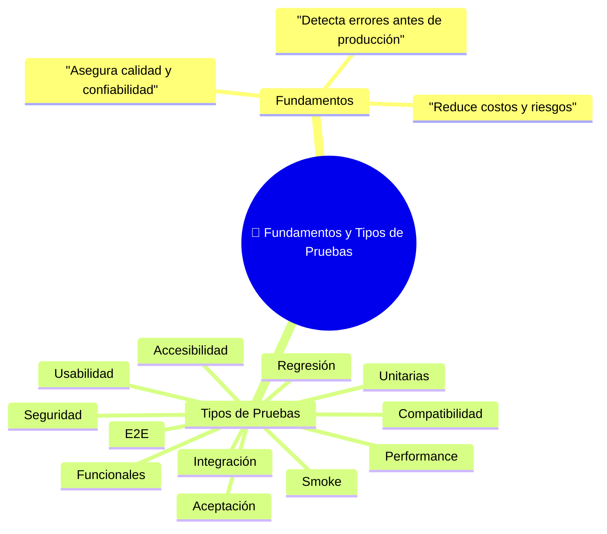
`

---

## 🧪 Estrategias y Metodologías


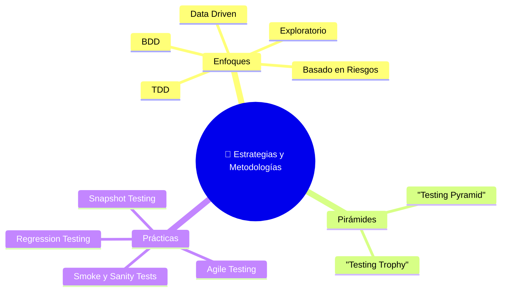


---

## 🧰 Herramientas y Ecosistema


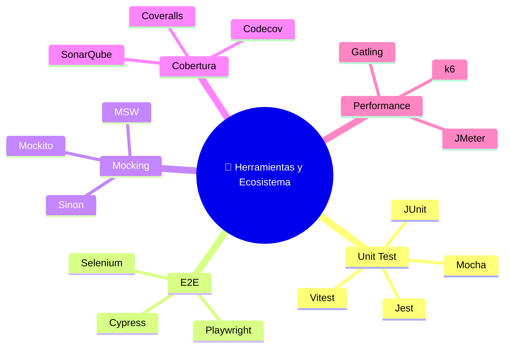


---

## 🔄 Automatización y CI/CD


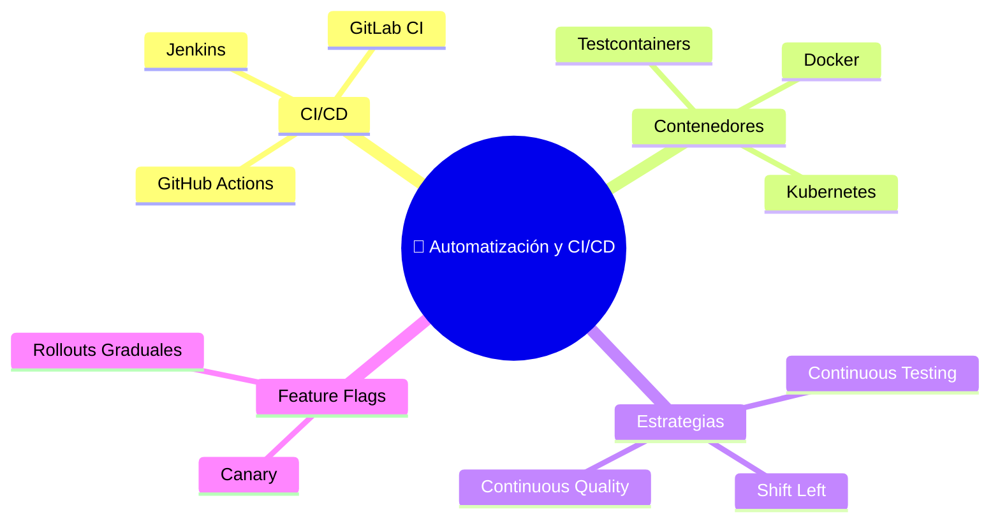


---

## 🌐 API, Frontend y Mobile Testing


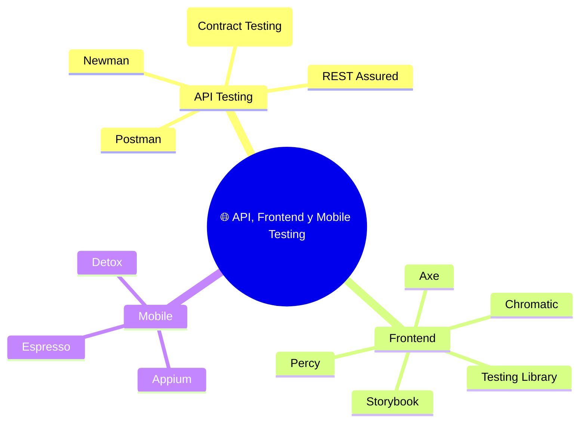


---

## ⚙️ Simulación y Dobles de Test


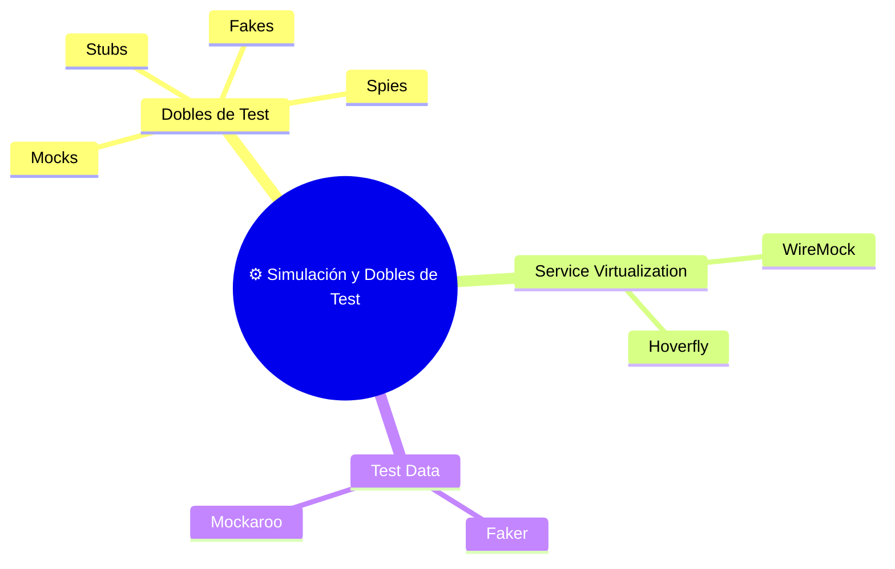


---

## 📈 QA, Reporting y Métricas


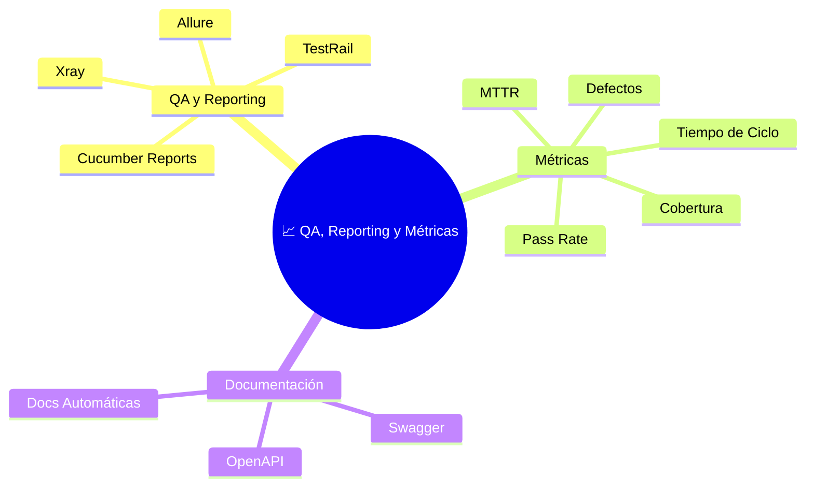


---

## 🧭 Futuro del Testing


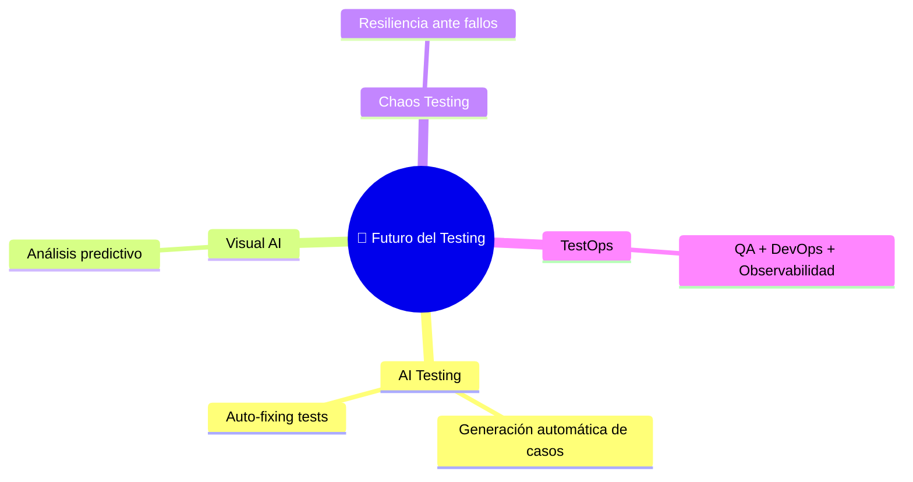


Perfecto 💪 Aquí tienes el **mapa conceptual completo y modular de Testing**,  
con **todos los módulos** (los originales + los nuevos complementarios)  
en un **bloque de código Markdown listo para Obsidian**:

---

# 🧠 Mapa Conceptual Completo de Testing 2
`$= dv.current().file.tags.join(" ")`

## Índice de Mapas
- [[#🧩 Fundamentos y Tipos de Pruebas]]
- [[#🧪 Estrategias y Metodologías]]
- [[#🧰 Herramientas y Ecosistema]]
- [[#🔄 Automatización y CI/CD]]
- [[#🌐 API, Frontend y Mobile Testing]]
- [[#⚙️ Simulación y Dobles de Test]]
- [[#📈 QA, Reporting y Métricas]]
- [[#🧭 Futuro del Testing]]
- [[#🧱 Arquitectura, Diseño y Entorno de Pruebas]]
- [[#🧮 Calidad de Software y Gestión del Riesgo]]
- [[#🧠 Cultura, Roles y Procesos en el Testing]]

---

## 🧩 Fundamentos y Tipos de Pruebas


`

---

## 🧪 Estrategias y Metodologías





---

## 🧰 Herramientas y Ecosistema





---

## 🔄 Automatización y CI/CD





---

## 🌐 API, Frontend y Mobile Testing





---

## ⚙️ Simulación y Dobles de Test





---

## 📈 QA, Reporting y Métricas





---

## 🧭 Futuro del Testing





---

## 🧱 Arquitectura, Diseño y Entorno de Pruebas


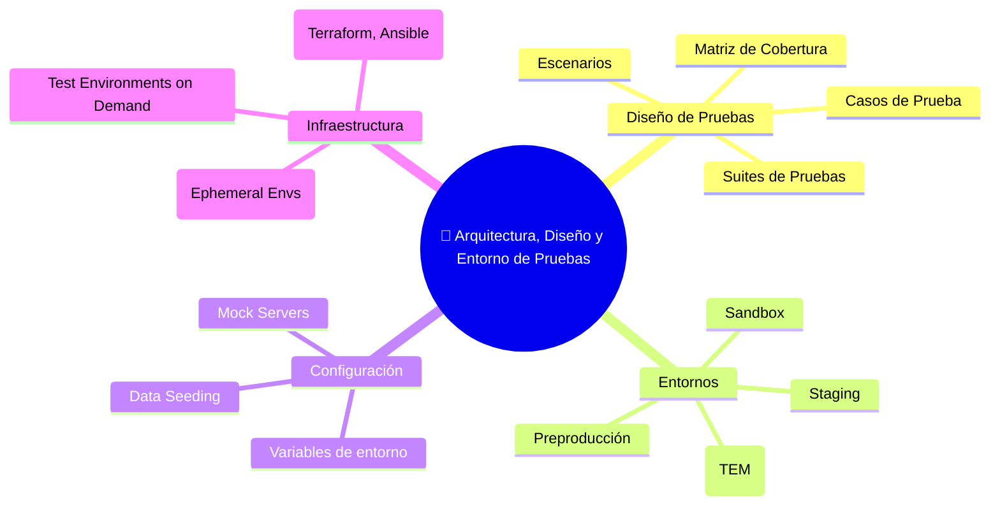


---

## 🧮 Calidad de Software y Gestión del Riesgo


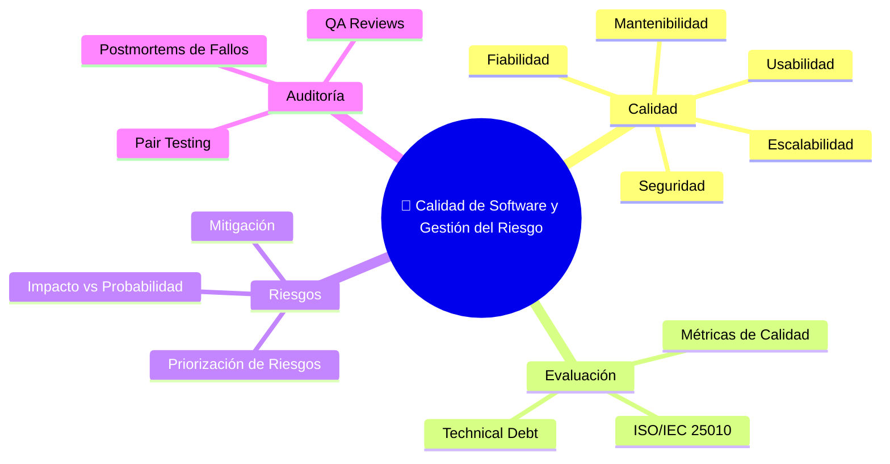


---

## 🧠 Cultura, Roles y Procesos en el Testing


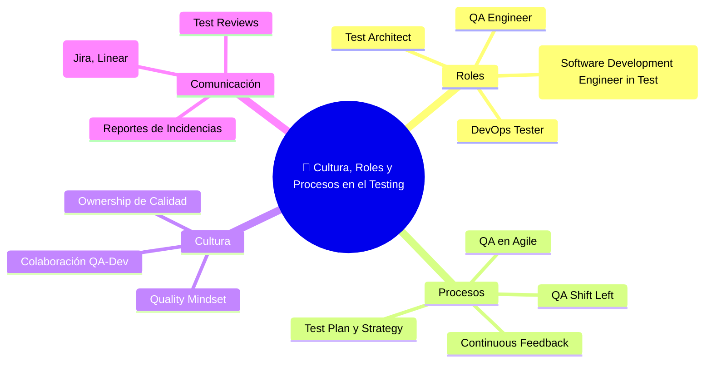


